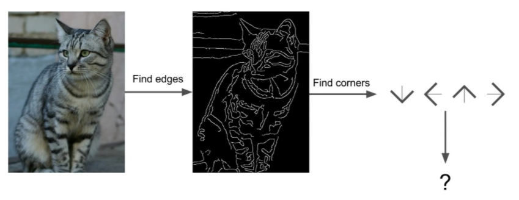
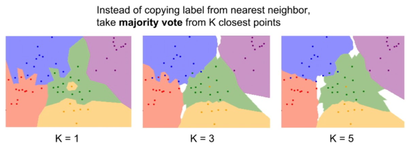
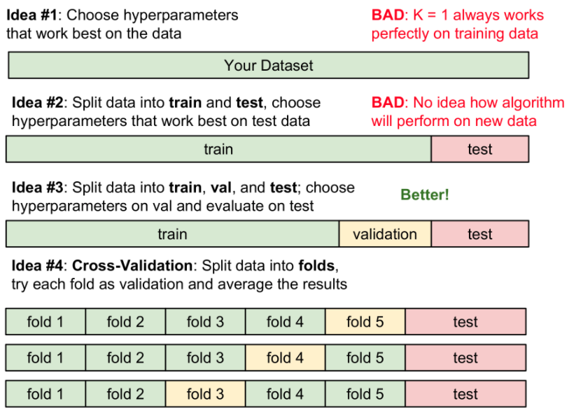

본 게시물은 [CS231n: Convolutional Neural Networks for Visual Recognition (2017)](http://cs231n.stanford.edu/2017/syllabus.html) 강의의 영상과 슬라이드를 기반을 작성 되었습니다.

---

## Image Classification
- 컴퓨터 비전 분야에서의 core task이자 CS231n에서 주로 다루기도하는 문제

### Image Classification은 어떻게 이루어 지는가?
1. 이미지를 입력받는다.
2. 정해진 카테고리 집합에서 컴퓨터가 이미지를 보고 어디에 속할지를 고른다.

👉 인간에게는 쉽지만 컴퓨터에게는 매우 어렵다.<br>
👉 컴퓨터에게 이미지 == 거대한 숫자판<br>

👉 `Semantic Gap` : 컴퓨터가 실제로 보고 있는 <u>숫자판</u>과, <u>고양이</u>라고 하는 의미 사이에 존재하는 간극

### Image Classification은 컴퓨터에게 어렵다!

1. viewpoint variation
  - 이미지에 미묘한 변화만 주더라고 픽셀 값이 광범위하게 변화한다.
  - 예를들어 고양이가 가만히 있더라도 카메라의 이동에 따라 픽셀값이 달라진다.
2. 조명 illumination
3. 변형 deformation
4. 가려짐 occlusion
5. 배경과의 유사함 Background Clutter
6. 클래스내의 다양성 Intraclass Variation

이런 것들을 모두 고려하였을 때, 컴퓨터가 이미지의 의미를 알아챈다는 것은 매우 어려워 보인다.<br>
👉 일부 제한된 상황이라면 잘 동작하는 기술이 존재한다!<br>
👉 앞으로의 강의에서는 이것이 어떻게 가능해졌는지 볼 것이다.

### 이전까지 이미지를 인식하기 위해 해왔던 시도
😺 **고양이 인식하기**

1. 이미지에서 edgds를 계산, 다양한 corners와 edges를 각 카테고리(귀, 코, ...)로 분류
2. 이들로부터 고양이라는 특징(귀가 두 개 코가 하나 등 고양이를 인식하기 위한 규칙)을 찾아낸다.

이러한 방식은 잘 동작하지 않는다.<br>
- 위에서 언급했던 문제들에 대해 강건하지 못하고
- 인식하고자 하는 새로운 객체가 등장하면 처음부터 모든 동작을 반복해 한다.

👉 다양한 객체들에 유연하게 적용가능한 알고리즘 필요<br>
👉 ML key insight : **`Data-Driven Approach`**가 등장하게 됨

### Data-Driven Approach
카테고리에 대한 규칙을 정하는 것이 아니라..!

1. 카테고리에 해당하는 엄청 많이 데이터를 수집하고
2. 데이터들을 이용하여 ML classifier(=model) 학습
3. 학습된 classifier를 새로운 이미지로 테스트한다.

```python
def train(images, labels):
  # Maching learning !
  return model

def predict(model, test_images):
  # Use model to predict labels
  return test_labels
```

🌟 지금부터 할 것 : 간단한 ML classifier부터 살펴보기

## Nearest Neighbor
```python
def train(images, labels):
  # Memorize all data and labels
  return model

def predict(model, test_images):
  # Predict the label of the most similar training image
  return test_labels
```
- Train 단계 : 모든 데이터와 라벨을 기억
- Predict 단계 : 새로운 이미지와 기존 이미지(학습에 사용된 이미지)를 비교하여 가장 유사한 학습 이미지의 라벨을 반환

### 예시로 보는 Nearest Neighbor의 동작(feat. CIFAR-10)


CIFAR-10은 10개의 클래스(비행기, 자동차, 새, ...)로 분류되는 50000장의 학습용 이미지와 10000장의 테스트 이미지로 구성되어 있다.

오른편의 그림은 Nearest Neighbor를 이용하여 예측을 진행한 결과이다. 그림의 왼쪽열이 테스트 이미지이고 오른쪽 방향으로 학습 이미지를 테스트 이미지와 유사한 순으로 정렬한 것이다. 2번째 줄의 2번째까지는 테스트 이미지의 카테고리과 같은 개를 유사한 이미지로 출력하지만 그 이후로는 사슴 혹은 말과 같은 다른 카테고리의 요소들을 출력하고 있다.<br>
👉 Nearest Neighbor 알고리즘 적용시 학습 데이터셋에서 가장 가까운 샘플을 찾아냄<br>
👉 이게 성능면에서는 좋지 않지만, 지금 단계에서 예시로 보기에는 가치가 있다.

### Nearest Neighbor 주요 안점
`두 이미지 쌍을 어떻게 비교할 것인가?`<br>
`비교를 위하여 어떤 비교함수를 사용할 것인가?`

앞의 예제 L1 Distrance(Manhattan distance, 이하 L1 Dist)를 사용하였다.


이는 두 이미지에서 같은 픽셀 위치에 있는 값끼리 뺀 후 절대값을 취하고 이후 모든 픽셀에 대한 수행결과를 더하는 것으로 계산된다. 단순한 동작이지만 <u>두 이미지간의 차이를 어떻게 측정할 것인가?</u>에 대한 구체적 답변이 된다.

### Nearest Neighbord의 한계점
#### 예측 시간
N개의 training set이 존재할 때, Nearest Neighbor의 `Train/Predict 함수의 속도`는 어떻게 될까?
- Train O(1) : 단순 저장
- Predict O(N) : N개의 학습 이미지와 입력 이미지를 모두 비교해야하기 때문, 느림

모바일 혹은 브라우저 또는 다른 저전력 장치에서 실행되는 실제 서비스에서는 학습시간은 상대적으로 오래 걸려도 괜찮으나 예측 시간(test/prediction time)이 빠르기를 원한다. 하지만, Nearest Neighbor는 그 수요와 정반대로 동작한다.

#### 분류 성능의 한계
Nearest Neighbor이 실제로 동작한 결과는 아래와 같은 결정 영역(decision regions)으로 그려낼 수 있다.


결정 영역에서 각 점은 학습 데이터이고 점의 색은 클래스(label)이 된다. 이 결정 영역의 색은 평면의 각 픽셀에 대해 훈련 데이터에서 가장 가까운 점을 찾아 해당 점의 클래스 레이블로 칠한 것이다. 이 경우 두가지 문제를 존재한다.

1. 초록색 영역 한 가운데에 노란색 섬이 존재.
2. 초록색 영역이 파란색 영역을 침범

이는 특정한 노란색 점 혹은 초록색 점이 잡음(noise)이거나 잘못된 정보(spurioius)인 경우 발생할 수 있다. 이를 통하여 Nearest Neighbor는 여러 상황에 대하여 충분히 강건하지 못하다 말할 수 있다.

## K-Nearest Neighbors(KNN)
위에서 언급된 Nearest Neighbor의 문제점을 해결하고자 KNN이 등장하게 된다. 이는 Distance metric를 이용하여 가까운 이웃을 `K`개만큼 찾고 이웃끼리 **투표(voting)**를 하여 가장 많은 득표수를 올린 레이블로 예측하는 방식이다.

+) 추가 : 투표 결과의 결정방식에도 다양한 방법이 존재하고 위에 언급된 가장 많은 득표수를 올린 레디블을 선택하는 방식을 Majority voting이라 한다.

### K


KNN에서 사용자가 선택하게 되는 값으로 투표에 참여할 이웃의 수를 의미한다.

대체로 K가 1보다 클때 결정경계가 부드러워지고 좋은 결과를 보이고 있다.

K가 1보다 클 때, 라벨이 결정되지 못한 흰색영역이 등장하는데 이는 투표 결과에서 승자를 확정할 수 없는 지역을 의미한다. 이 부분을 추론 혹은 랜덤으로 값을 채울 수도 있지만, 현재는 간단한 예제를 보는 것이 목적이기 때문에 흰색으로 칠해 두었다.

### Distance Metric
KNN에서 사용자가 선택하게 되는 또 다른 값으로 <u>서로 다른 점들을 어떻게 비교할 것인가</u>에 대한 방법이다.


이전까지의 예제에서는 L1 Dist로 픽셀간 차이의 절대값의 합을 구하였다. 이번에 추가로 소개할 방법은 L2 Distance(Euclidean Distance, 이하 L2 Dist)로 두 거리의 차의 제곱합의 제곱근을 계산하는 것으로 구할 수 있다.

위의 그림은 그래프는 원점에서 떨어져 있는 거리가 같은 점들을 모아 놓은 것이다. 강의에서는 거리 척도(L1, L2)에 따라 공간의 근본적인 기하하적 구조 자체가 서로 다르게 된다고 표현하고 있다.

- L1 Dist은 좌표계에 영향을 받는다.
  - 어떤 벡터가 있고 각 요소가 어떤 특별한 의미를 가질 때 더 유용할 수도 있다. 즉, 특정 벡터의 각각 요소들이 개별적인 의미를 가진다면(키/몸무게) L1 Dist가 더 유용할 *수도* 있다.
- 그렇지 않고 각 요소간의 실직적인 의미를 잘 모르는 경우에는 L2가 더 유용할 *수도* 있다.
- Problem-dependent 문제 의존적인 부분이기에 실제로 실험을 해보지 않는 이상 어떤것도 확신할 수는 없다.


위 그림에서는 거리 척도에 따라 발생하는 기하하적 변화를 확인 가능하다. 경계의 모양이 L1 Dist일 때, L2 Dist일 때가 서로 다른 것을 볼 수 있다. L1은 좌표축의 영향을 받기 때문에 경계가 수직 혹은 수평에 가깝다. L2는 축의 영향을 받지 않기 때문에 더 자연스럽게 결정경계가 만들어진다.

다양한 거리척도를 이용하면 KNN으로 다양한 데이터를 다룰 수 있다. 벡터/이미지/문장 등 데이터 사이에 거리를 구할 수 있는 척도가 존재한다면 KNN 적용이 모두 가능하다. 추가로 KNN은 아주 단순한 알고리즘이어서 새로운 문제를 접했을 때 가장 먼저 간단히 시도해볼만하다.

### 하이퍼 파라미터
이전 파트에서 다룬 K와 L1/L2 Dist와 같이 Train time에 학습되는 것이 아닌 학습전에 사용자가 선택하게 되는 값들을 **하이퍼 파라미터**라고 한다.

**어떻게 구할까?**<br>
다양한 하이퍼 파라미터 값을 시도해보고 가장 좋은 값을 찾는다.<br>
`다양한 하이퍼 파라미터를 시도해 보는 것`과 `가장 좋은 값을 선택하는 것` 은 어떻게 해야 할까? 강의에서는 **<u>4가지 아이디어</u>**를 제시하고 있다.



1. **전체 데이터셋에 대하여 분류기의 정확도와 성능을 가장 높게 만들어 주는 값을 탐색**
    - 끔찍한 방법🤒
    - K=1이 가장 정확하게 training data를 분류하며, K가 1보다 클 때는 학습 데이터 중 몇 개를 잘못 분류할 수 있다. 하지만 학습데이터에 포함되어 있지 않았던 데이터에 대해서는 후자가 더 좋은 성능을 보일 수 있다.
    - ML에서는 학습데이터를 얼마나 잘 맞추는지는 중요하지 않고, 학습시킨 분류기가 **처음 보는 데이터를 얼마나 잘 분류**해내냐가 중요하다.
2. **전체를 쪼개어 일부를 테스트 데이터로 사용한다.**
    - 학습 데이터를 사용하며 다양한 하이퍼 파라미터를 교체해가며 분류기를 학습시키고 테스트 데이터로 성능을 평가한다. 실험결과 테스트 데이터에서의 성능과 지표가 가장 좋은 하이퍼 파라미터를 선택한다.
    - 끔찍한 방법 2🤒
    - ML에서는 처음 보는 데이터를 얼마나 잘 맞추냐가 중요한데 이 경우는 테스트 데이터를 얼마나 잘 맞추냐를 기준으로 하이퍼 파라미터가 선택되었다.
    - **테스트셋이 처음보는 데이터를 대표하지 못하게 되었다.**
3. **일반적인 방법 : 세개로 나눈다. trainig, validation, test**
    - 학습 데이터를 사용하며 다양한 하이퍼 파라미터를 교체해가며 분류기를 학습시키고 검증 데이터(validation)로 성능을 평가한다. 실험결과 validation 데이터에서의 성능과 지표가 가장 좋은 하이퍼 파라미터를 선택한다.
    - 모든 것이 확정되고 난 후, **테스트 데이터로 "단 한번"의 검증을 수행**한다. 테스트 데이터가 처음보는 데이터의 대표가 되며 이 값이 논문이나 보고서에 들어가는 값이 된다.
4. **교차 검증**
    - 데이터셋이 작을 때 사용한다.
    - 딥러닝에서는 많이 사용하지 않는다 → 큰 모델을 학습시킬때는 학습 자체가 계산량이 많아 이런 부가적인 연산이 필요한 작업을 거의 사용하지 않는다.
    - 테스트 데이터를 따로 빼고 나머지 데이터를 여러 부분으로 쪼갠다.
    - 쪼개진 부분을 번갈아가면서 validation set으로 사용

### K의 변화에 따른 정확도 변화

- x축 K, y축 분류 정확도를 의미한다.
- **이 그래프로 알 수 있는 것**
    - K에 따른 분류 정확도 변화
    - 하이퍼 파라미터별 validation folds 별 성능 분산
- 이 그래프가 주어졌을 때, **validaiton set 성능이 최대인 하이퍼 파라미터를 선택**하게 된다.

### KNN은 이미지 분류에 잘 사용되지 않는다

**이유 1. <u>test time이 너무 느리다.</u>**

**이유 2. <u>L1/L2 Dist가 이미지간의 거리 측정에 적절하지 않다.</u>**


- 기존 이미지에 세가지 왜곡을 주었을 때, 왜곡된 이미지와 원본 사이의 L2 Dist는 모두 동일(저스틴이 L2가 같도록 섬세하게 생성함)
- L2 Dist는 perceptual distances를 측정하는데 적합하지 않다.

**이유 3. <u>차원의 저주</u>**


- KNN이 하는일 → 학습 데이터의 공간을 분할하는 것
- KNN이 잘 동작하려면 공간을 분류하기에 충분할 만큼 조밀한 학습 데이터가 필요하다.
- 공간을 조밀하게 덮을려면 충분한 양의 학습 데이터 필요하며 차원이 증가함에 따라 더 많은 양의 데이터가 필요하게 된다. 고화질의 이미지일 수록 모든 공간을 매울만큼의 데이터를 구하기란 쉽지 않다.
- 추가 자료 : [http://thesciencelife.com/archives/1001](http://thesciencelife.com/archives/1001)

👏 **Summary** 이미지 분류가 무엇인지 설명하기 위해 KNN을 예제로 들어보았다!

## **Linear Classification**
- 간단하지만 아주 중요하며 neural networks(이하 NN)과 convolutional neural networks(이하 CNN)의 기반이 된다.
- **NN**는 레고 블럭처럼 여러 구성요소(component)를 끼워 맞춰 거대한 네트워크를 구성하는 것이라 볼 수 있다.
- 이때 기본이 되는 **NN**이 Linear Classifiation이라 할 수 있다. 이것을 이해함으로써 전체 NN이 어떤식으로 작동하는지 이해할 수 있을 것이다.

### **Parametric Approach(feat. CIFAR-10)**

- Linear classification은 <u>Parametric Model</u>의 가장 단순한 형태이다.


- Parametric Model(x, W) => y
    - x : 입력값
    - **W : 가중치**
    - y : CIFAR-10의 각 10개의 클래스 점수, 점수가 높을 수록 해당 클래스일 확률이 높다는 것을 의미
- 파라미터 등장! <u>**학습 데이터의 정보를 요약하여 파라미터에 모아둔다.**</u>
    - test time에 training data가 더 이상 필요없어져 속도가 증가한다.
    - 딥러닝은 함수 ***f*** 의 구조를 적절하게 잘 설계하는 것이 주요 task라 볼 수 있다.
    - 어떤 식으로 가중치와 데이터를 조합할 것인가를 고민하는 과정이 다양한 NN 아키텍쳐를 설계하는 과정이 될 것이다.
    - 가장 쉬운 방법 : <u>가중치와 데이터를 그냥 곱하는 것</u> → **Linear classifier**


- f(x, W) = Wx
    - 입력 이미지 32x32x3 → 평탄화 : 3072x1 dim → 10-class score
    - (10x3072) * (3072x1) = (10x1) → W의 shape는 (10x3072)가 되어야 한다.
- bias
    - class수과 같은 1차원 벡터
    - 데이터와 무관하게 특정 클래스에 우선권을 부가한다. 학습 이미지에 불균형이 있는 상황 등에 유용할 것이다.
- 계산 예시
    
    - (0.2 × 56)+(-0.5 x 231)+(0.1 × 24)+(2 × 2)+1.1 = -96.8
- linear classifier는 각 클래스를 구분시켜 주는 선형의 경계를 그어주는 역할

#### **linear classification**이 직면할 수 있는 문제

다양한 사례들이지만 결국 선분 하나로 데이터를 분류할 수 없다는 문제로 정리도니다.

### **summary**
- linear classifier의 수식 → 단순 행렬과 벡터의 곱
- 가중치 행렬 w를 학습시키고 나면 새로운 학습 데이터에도 스코어를 매길 수 있다.
- W를 어떻게 구할 수 있는지는 배우지는 않았다. → 다음 언제가에 계속..

<br>
<br>
