본 게시물은 [CS231n: Convolutional Neural Networks for Visual Recognition (2017)](http://cs231n.stanford.edu/2017/syllabus.html) 강의의 영상과 슬라이드를 기반을 작성 되었습니다.

---

# Recurrent Neural Networks
📌 RNN은 가변 길이(0~N) 데이터를 입출력으로 받아들일 수 있는 네트워크 구조

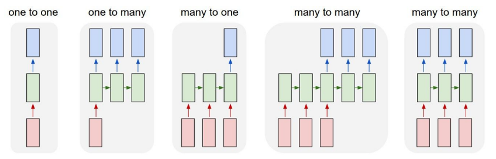

| 유형 | 입력 | 출력 | 예시 |
|:---:|:----:|:---:|:----|
| One to One | 단일 | 단일 | 지금까지 강의에서 다룬 아키텍쳐(Vanilla Neural network) |
| One to Many | 고정 | 가변 | Image captioning |
| Many to One | 가변 | 단일 | Sentiment Classification, Video Classification |
| Many to Many | 가변 | 가변 | 입출력의 길이가 다른 경우 : Machine Translation<br>입출력의 길이가 같은 경우 : Video classification on frame level |

- 단일 입출력 예시 : 이미지, 숫자(라벨, 확률값, ...)
- 가변 입출력 예시 : 문장, 비디오


## RNN

### 1. 기본 구조

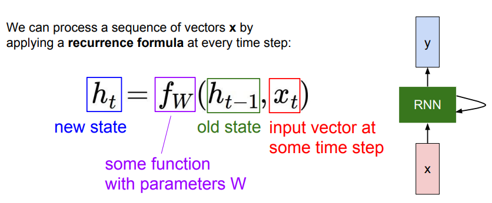

#### 1-1️⃣ 기본 동작 방식
1. RNN이 입력(x)을 받는다.
2. RNN 내부의 hidden state를 업데이트한다.
3. RNN 뒤의 FC Layer에서 출력값을 내보낸다.

#### 1-2️⃣ 기본 수식
현재 시점 *t*에 대하여 아래와 같은 **점화식(recurrence formula)**로 표현된다.

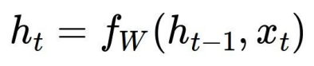

- x\_t : 입력값
- h\_{t\_1} : hidden state의 이전(*t-1*) 상태
- f\_W : 파라미터 W를 이용하는 함수
- h\_t : 현재 시점의 hidden state
이때, <u>함수 *f*와 파라미터 *W*는 모든 시점에서 동일</u>하다.

<br>
<br>

## Vanilla RNN
📌 가장 단순한 RNN 예시

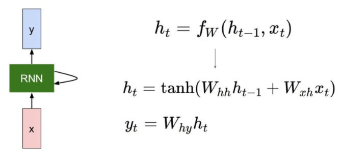

- 이전 hidden state와 현재 입력을 통하여 다음 hidden state를 출력하는 기본 형식은 동일
- function을 `tanh` 사용
    - 비선형성을 위해 적용됨
    - <details>
        <summary>tanh를 사용하는 이유</summary>
        <div markdown="1">

        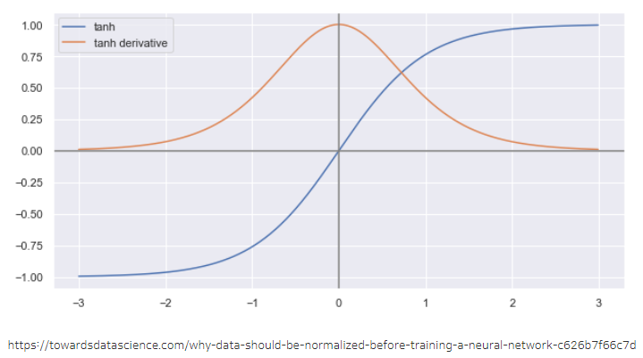
        tanh의 미분값은 sigmoid에 비하여 그 결과 값의 범위가 넓은 편이기 때문에 sigmoid에 비해 vanishing gradient 문제가 생길 가능적이 상대적으로 적다.

        </div>
    </details>

- W\_{hh} : *t-1* 시점에서 얻어진 *h_{t-1}*와 곱해지는 h시점의 가중치 W_{h}, hidden 사이의 가중치
- W\_{xh} : *t* 시점에서 입력값과 곱해지는 가중치
- W\_{hy} : *t* 시점에서 hidden state와 곱해서 y_t(출력값)을 도출하는 가중치


### 1. Computational graph로 살펴보는 RNN
RNN이 hidden state를 가지며 이를 <u>재귀적</u>으로 호출하며 반영한다. 위에서 살펴본 각 경우에 어떤식으로 RNN이 전개되는지 알아보자🤔

#### 1-1️⃣ Many to Many
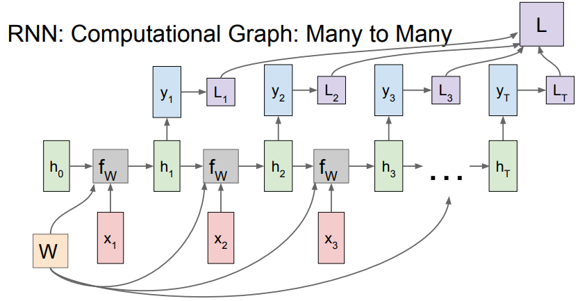

```markdown
h_0, 입력 x_1 ⇒ h_1 = f_W(h_0, x_1) ⇒ y_1, L_1
h_1, 입력 x_2 ⇒ h_2 = f_W(h_1, x_2) ⇒ y_2, L_2
...
h_{t-1}, 입력 x_t ⇒ h_t = f_W(h_{t-1}, x_t) ⇒ y_t, L_t
L_{total} = sum(L_1, L_2, ..., L_t)
```

#### 1-2️⃣ Many to One
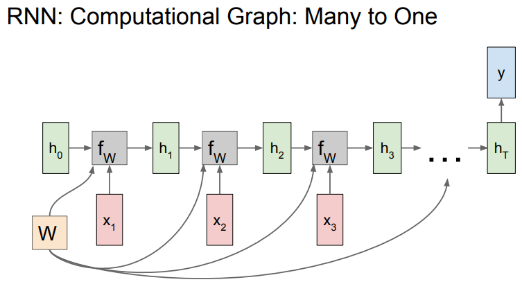

위와 다르게 최종 hidden state에서만 결과값이 출력된다.

#### 1-3️⃣ Many to One
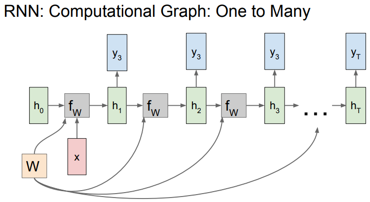

고정 입력 x는 모델의 initial hidden state를 초기화 시키는데 사용된다.

#### 1-4️⃣ Sequence to Sequence
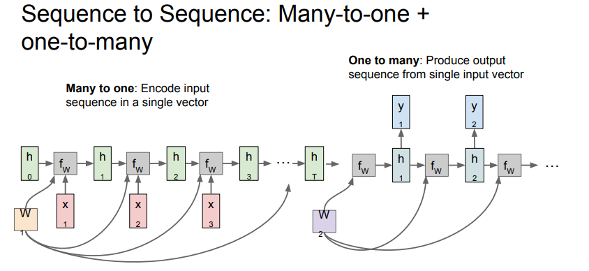

**<u>(Many to one) + (One to many)</u>**
- Many to one : Encoder, 가변입력을 받아 하나의 벡터로 요약한다.
- One to many : Decoder, Encoder에서 요약된 정보를 입력으로 받아 가변 출력을 반환한다.
- decoder의 output을 이용하여 loss를 계산하고 backpropagation을 진행한다.


### 2. 구체적 예시로 살펴보는 RNN : 언어모델
- 언어모델
    - 강의 : 어떻게 자연어를 만들어낼지를 해결하려는 모델
    - 통계기반의 확률모델, 단어 시퀀스 이후에 이후에 어떤 단어가 등장할 확률을 통해서 문장을 생성한다.

📌 **Character-level Language Model**
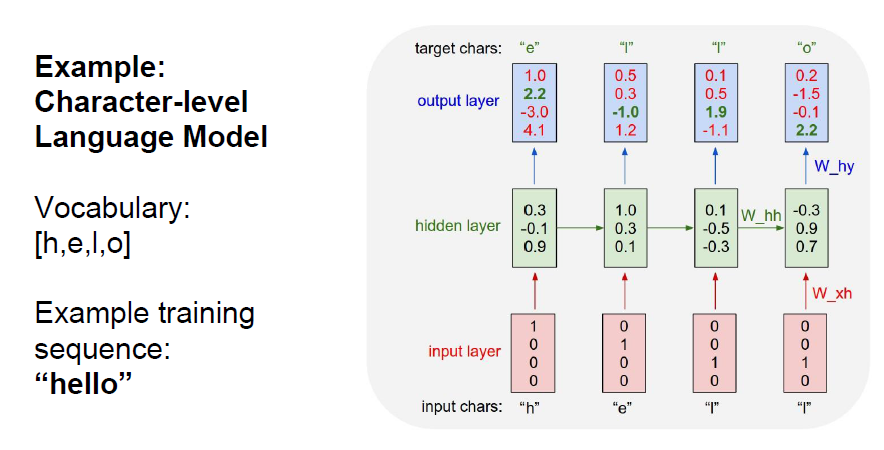
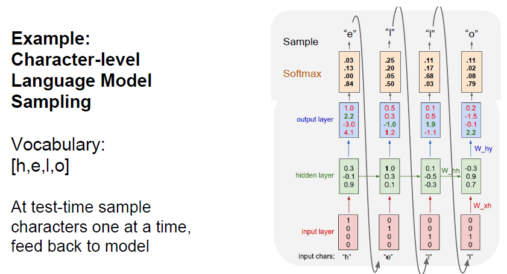


<u>"hello" 학습시키기</u></br>
- 사용하는 4개의 알파벳을 원-핫 인코딩을 통하여 벡터화하여 단어사전에 저장
- train : ground truth와 ouput를 이용하여 Loss 계산
- test
    - **h**를 초기에 입력 → 출력 **e**를 얻음 → **e**를 입력 → 출력 **l**를 얻음 → **l**를 입력 → 출력 **l**를 얻음 → **l**를 입력 → 출력 **o**를 얻음 ⇒ **h를 입력하여 hello를 얻음**
    - 흥미로운 점 : 마지막 시퀀스에서 "l"의 확률이 가장 높은데 "o"가 출력되었다. 👉 출력부에서 softmax로 확률을 도출하고 이들 중 가장 큰 값을 출력하는 것이 아닌 sampling을 통하여 값을 선택하기 때문이다. 👉 모델의 다양성을 높여 적절한 output을 얻게한다.

### 3. Backpropagation
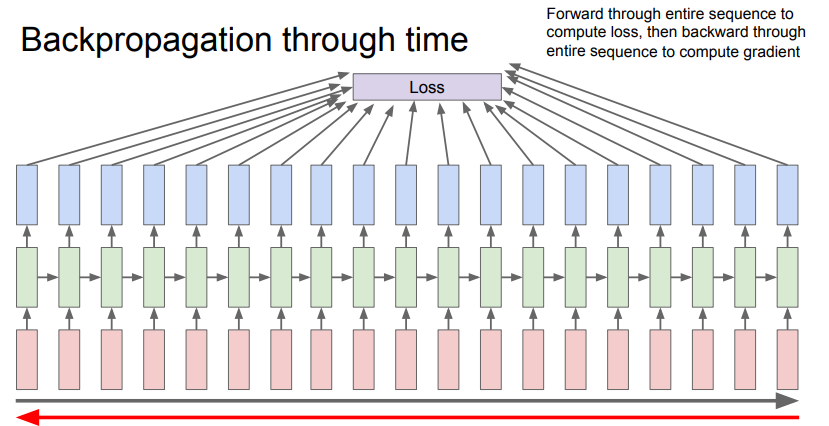
- Backpropagation through time
    - 이전에 살펴보았던 모델들을 생각해보면 스텝마다 출력값이 존재하고 이 출력값들의 Loss를 계산하고 이를 조합하여 Final loss를 얻는다. 그리고 해당 값을 이용하여 역전파를 진행한다.
    - RNN에서 만약 아주 긴 문서를 학습한다고 가정하였을 때, 이 작업은 매우 많은 메모리를 요구하게 된다.

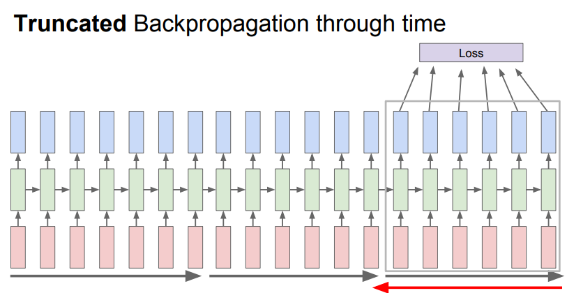
- Truncated Backpropagation through time
    - 대체 근사 알고리즘
    - Train time에서 전체 스퀀스를 적당한 step 단위로 잘라 해당 step이 지난 후 step만큼의 서브스퀀스 단위로 Loss를 계산하고 gradient를 계산한다.
    - 이전 강의에서 mini batch를 이용하여 gradient를 계산했던 것과 유사한 아이디어

### 4. 예시
#### 4-1️⃣ Example: Character generation
- 셰익스피어 작품을 학습시킨 문장 생성기
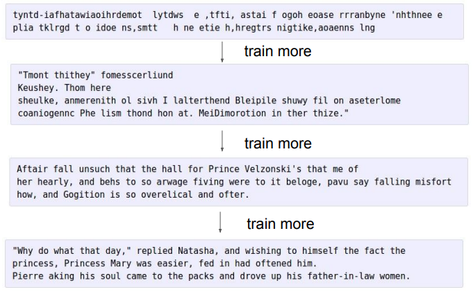

- LaTex 코드를 포함한 위상 수학책을 학습시킨 문장 생성기
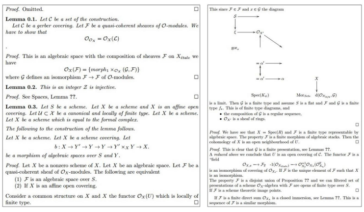

- c언어 코드를 학습시킨 문장 생성기
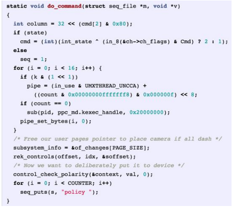

#### 4-2️⃣ Example: Interpretability
- RNN에서 스퀀스 데이터를 학습이 되기는 하는데, 데이터에서 "무엇을" 학습하는지는 어떻게 알 수 있을까?
- 데이터를 특정 dataset으로 학습시킨후 hidden vector를 뽑아 어떤 값들이 들어있는지 살펴본다 👉 서로 다른 hidden states가 어떤 것들을 예의주시하는지 알 수 있을지도..?

<br>

- 색 : 시퀀스를 읽는 동안에 앞서 뽑은 hidden vector의 값
- 대부분의 hidden state는 아무 의미 없는 패턴으로 문장을 살펴보고 있다.
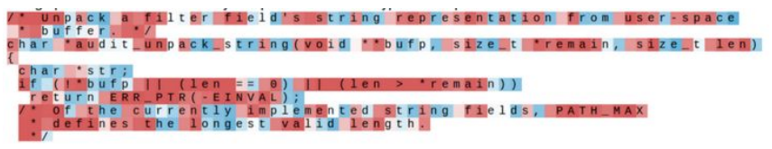

- 따옴표를 기준으로 패턴을 인식 👉 `"`를 추적
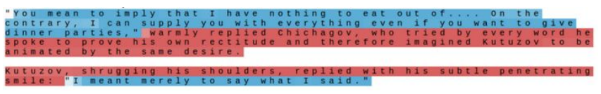

- 줄의 단어 갯수를 세는 것 같은 패턴도 존재 👉 `\n`을 추적
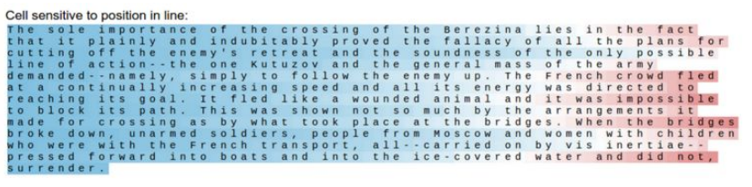

- if 문 안에서 조건문 부분을 추적
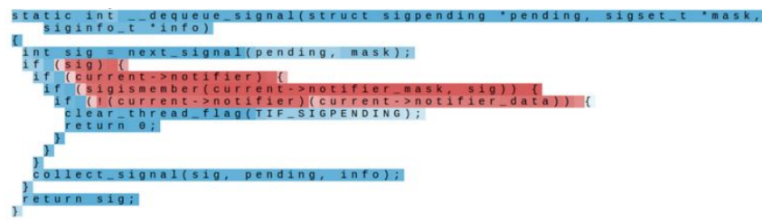

👉 dataset을 학습시켰을 뿐인데 많은 것들을 찾아내고 있는 것을 확인할 수 있다.

#### 4-3️⃣ Example: Image captioning
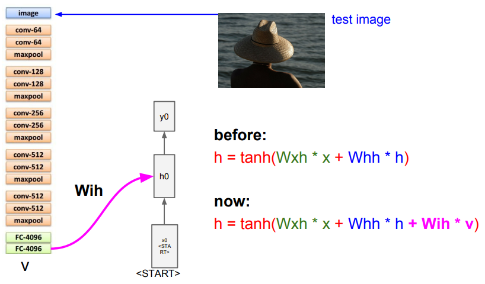
- 주어진 이미지에 대한 설명문을 출력하는 task
- CNN에서 요약된 이미지 정보가 들어있는 vector(feature map)을 RNN의 초기 입력으로 사용
- 기존 Vanilla RNN 식에서 CNN의 출력 벡터에 새로운 가중치(W_ih)를 곱하여 더한다.

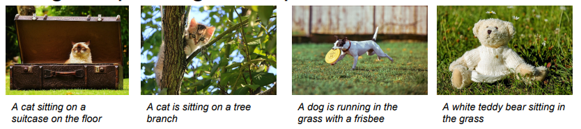
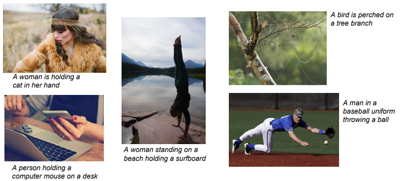
- 학습결과 어떤 경우에는 작 잘동하지만, 어떤 경우에는 그렇지 않음을 볼 수 있다.

✨ **Image Captioning with Attention**
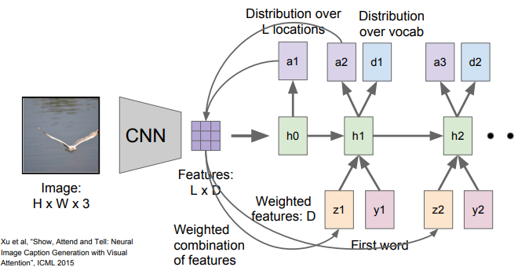

- CNN에서 하나의 벡터가 아닌 각 벡터의 공간정보를 가지고 있는 grid of vector를 만든다.
- z : 모델이 이미지에서 보고 싶은 위치에 대한 분포 👉 모델이 어느 위치를 봐야하는지에 대한 attention
- h0이 이미지의 위치에 대한 분포(a1)를 계산하고, 이 분포를 다시 벡터집합(LXD)와 연산하여 이미지 attention (z1)을 생성한다.
- 이 요약된 벡터는 다름 입력으로 들어간다. 결과로는 vocabulary의 각 단어들의 분포(d1), 그리고 다른 하나 (a2)는 이미지 위치에 대한 분포이다.
- 이것은 결국 feature map에 위치정보를 더하여 RNN이 해당 시간에 어떤 부분을 보아야 하지는를 떼어서 제공해 주는 역할을 한다고도 볼 수 있다.

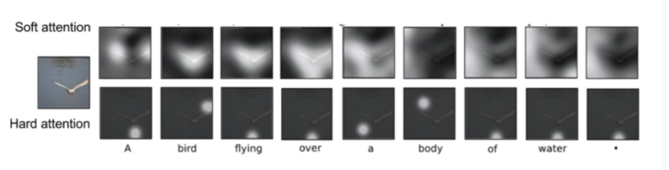
- 문장 생성시 위의 그림에서처럼 이미지내에 여러 부분에 attention을 주는 것을 볼 수 있다.
- Soft attention : 이미지의 모든 특징과 이미지 위치간의 가중합을 구해서 attention을 결정 👉 전체를 보는 대신 어떤 부분은 좀 힘을 줘서 본다.
- Hard attention : 이미지의 위치를 한 번에 단 한곳만을 본다.

#### 4-4️⃣ Example: Visual Question Answering
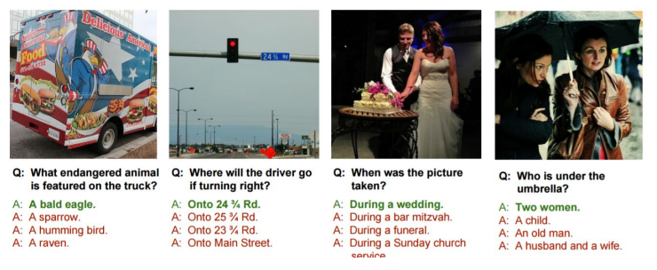
- 이미지와 질문을 입력받아 질문에 대한 답이 출력
- CNN + RNN + Attention
    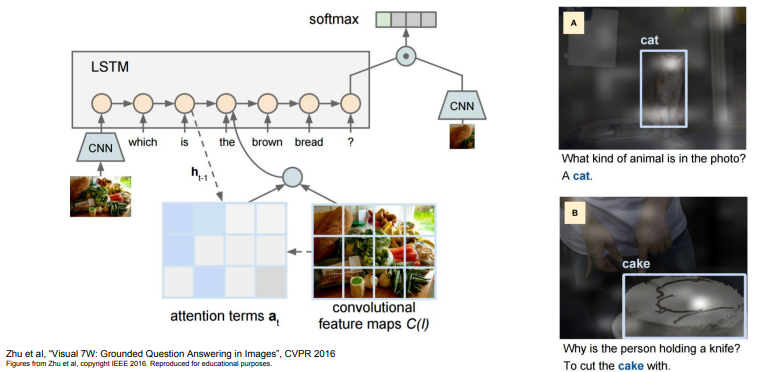
    - CNN을 통히여 이미지를 요약하고 RNN을 통하여 질문을 요약한다.
    - 두 모델에서 나온 벡터를 조합하여 질문의 답변에 대한 분포를 예측하여 답변을 출력한다.
    - 이 과정에선 attention을 사용하기도 한다.


## RNN variants
### 1. Vanilla RNN의 문제점
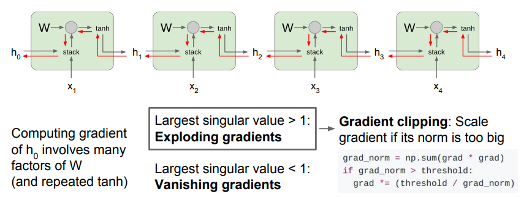
- backward pass시에 계속적으로 W Transpose가 관여하게 된다.


- 이 경우, 곱해지는 값이 1보다 크거나 1보다 작을 경우 각각 exploding과 vanishing의 문제가 발생하게 된다. exploding은 gradient clipping(gradient 의 L2 norm 이 기준값을 초과할 경우 threshold/L2 norm 을 곱하여 정규화)을 통하여 제어가 가능하나, vanishing은 결국 gradient vanishing을 야기한다.
- RNN은 뒤로갈수록 앞의 내용를 잊게 되고 이런 문제를 장기 의존성 문제라고 한다.

### 2. Long Short Term Memory (LSTM)
#### 2-1️⃣ 순전파
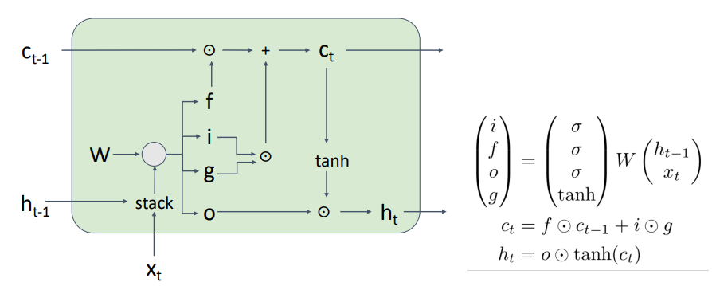
- RNN에서의 장기 의존성 문제를 해결하기 위하여 gate를 도입
- LST는 두개의 state(C\_t : Cell state, h\_t : Hidden state)를 유지하며 hidden state와 입력값(x)의 결과를 4개의 게이트(i, f, o, g)통과시켜 출력한다.

| 게이트 | 연산| 의미 |
|:-----:|:---|:----|
| i(input gate) | sigmoid | 현재 정보를 저장할지 결정 |
| f(forget gate) | sigmoid | 과거 정보를 버릴지 말지 결정 |
| o(output gate) | sigomoid | cell state 를 얼마나 밖으로 출력할 것이냐를 결정 |
| g(gate gate) | tanh | input을 얼마나 포함시킬 것인가를 결정 |

1. forget gate - C\_{t\_1}
    - forget gate가 0~1 사이의 값을 가지며 C\_{t_1}와 곱해진다.
    - cell state를 다음 단계로 가지고 갈 것은가를 결정
2. input gate - gate gate
    - gate gate는 -1~1 사이의 값을 가지고, input gate는 0~1 사이의 값을 가진다.
    - gate gate는 방향(값을 빼고 싶은가 더하고 싶은가), input은 양(얼마나 뻬거나 더하고 싶은가)를 결정
    - cell state의 어떤 값을 얼마나 쓰고 싶은가를 결정
3. output gate - tanh(C\_t)
    - t 시점에서의 cell state를 얼마나 hidden state로 넘겨 줄 것인가

#### 2-2️⃣ 역전파
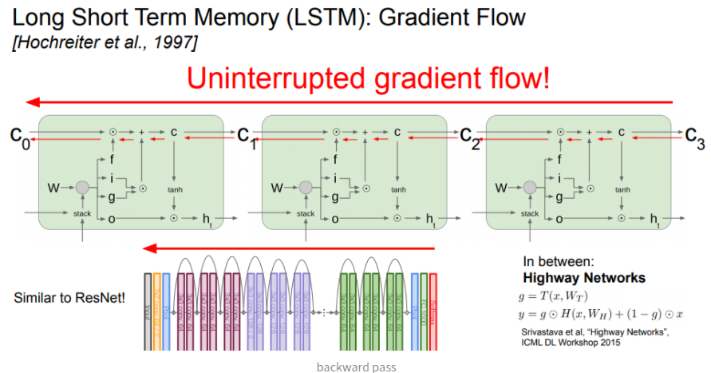
- 역전파시 Cell state는 정보를 잃지 않으면서 grdient 값을 구할 수 있다.
    - C\_t는 역전파 되면서 sum gate와 element wise gate만을 만난다.
    - non-linearity에 의한 문제가 없다.
- 여러개의 cell을 연결하더라고 역전파 경로에 방해되는 것은 없다.
    - gradient vanishing 문제를 해결

### 3. Other RNN Variants
- GRU(Gated Recurrent Unit)
    - Vanishing gradient 문제를 회피하기 위해 element-wise를 사용
- LSTM: A Search Space Odyssey
    - LSTM의 수식/모델을 변형시키며 실험을 진행
    - 결론 : 전부 비슷하다
- An Empirical Exploration of Recurrent Network Architectures
    - 아주 많은 임의의 RNN 아키텍쳐를 실험
    - GRU와 LSTM 보다 엄청나게 좋은 모델을 찾아내지는 못함


## SUMMARY
- RNN은 모델 설계에 있어서 유연성을 제공하고 많은 시도를 할 수 있게 해준다.
- Vanilla RNN은 잘 작동하지 않는다.
- 대체로 LSTM이나 GRU를 사용한다.
- RNN에서는 기울기가 exploding 또는 vanishing 될 수 있다.
    - exploding - gradient clipping
    - vanishing - LSTM

---
#### REF
- [RNN(Recurrent Neural Network) 이해하기](https://brightwon.tistory.com/10)
- [1) 언어 모델(Language Model)이란?](https://wikidocs.net/21668)
- [CS231n Lecture 10 : Recurrent Neural Networks](https://yun905.tistory.com/31)