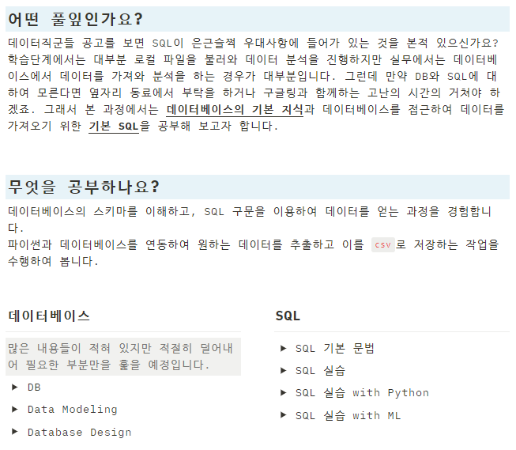

과정이 하반기로 들어서면서 새로운 풀잎스쿨을 준비하게 되었다🤦‍♀️ 
수강생분들의 삶에 유용한 무언가를 하고 싶었던 와중에 문득 <a href="https://brunch.co.kr/@modulabs/29">선배팅</a>에서 들었던 `데이터 분석가에게 SQL이 중요하다.`라는 말이 생각났다.

그리고 곰곰히 생각해 보니 SQL은 
> 데이터 분석을 키워드로 잡고 있는 강남캠과도 어울리고, 
나름 잘 아는 것이라 진행도 잘할 수 있을 것 같고, 
교육과정에서 살짝 찍먹했기에 수강생분들께 많이 낯설지도 않으며 
나도 새로운 것(BigQuery)을 더 학습할 수 있는

완벽한 풀잎 컨텐츠였다👍

---

## 풀잎 설계

- 대상
  - SQL의 존재는 알고 있으나, 아직은 낯선 분
  - python을 다뤄 볼 줄 아시는 분(pandas)
- 목표
  - 파이썬을 이용하여 데이터베이스에 데이터를 읽어들이고 이를 가공하여 csv로 저장할 수 있다.

### 커리큘럼 구상
- 세부적인 이론보다는 실습이 많이 들어갈 수 있도록 커리큘럼은 구성하고자 하였다. 풀잎이 총 5주동안 진행되기 때문에 이론+과제를 2주, 실습을 3주로 할당하였다.
- 교육과정에서 SQLite를 가볍게 다룬 적이 있기 때문에, SQLite를 기본적인 실습환경으로 잡았다. 추가적으로 BigQuery 역시 배치하였는다. 개인적인 공부 목적도 있었고 이미 로컬환경에서의 DBMS를 사용해 본 적이 있으신 수강생 분들께 제공될 `새로운 무언가`가 되어줄 것이다.
- 실습은 크게 3가지로 구상하였다. 이 중 2번까지를 모든 수강생분이 진행하는 것을 목표로 한다. 마지막주차의 내용은 추가적인 내용으로 다루고자 한다.
  - SQL 실습 : 정확히는 SELECT 실습. 데이터를 포함하고 있는 DB와 데이터에서 주어진 조건에 맞는 데이터들을 출력하는 식의 문제를 제공.
  - SQL 실습 With Python : python을 이용하여 DB의 데이터를 읽어오는 실습. 적당히 큰 데이터셋을 선정하는 것이 관건. 데이터를 적절히 가공하여 csv로 저장하는 것까지 진행. DB와 베이스라인을 jupyter notebook으로 제공.
  - SQL 실습 With Python : ML Project에서 DB가 가지는 위치와 동작 방식에 대해 다룬다.

#### 1주차 : DB, Data Modeling, Database Design

📜 세부내용

- DB
  - DB란 무엇인가?
  - DB의 종류에는 어떤 것이 있는가?
- Data Modeling
  - 실세계의 정보를 어떻게 컴퓨터에 저장할 것인가?
  - Object-Oriented Data Model
    - UML Class Diagram
      - Class
        - Attributes
        - Operations
        - Relationships
            - Associations
            - Generalization
            - Dependency
            - Realization
        - Constraint Rules and Notes
            - Key Constraints
            - Referential Integrity
            - Weak Entity Sets
    - **(실습 1-1) 주어진 Class Diagram을 해석하여 보자. notion**
    - **(실습 1-2) 주어진 상황을 보고 Class Diagram을 작성하여 보자.**
    - **(실습 1-3) 주어진 Class Diagram을 python의 Class로 작성하여 보자.**
  - Relational Data Model
    - E-R Model
- Database Design
    - 실세계의 정보를 어떻게 데이터베이스에 저장할 것인가?
    - DBMS와 SQL은 무엇인가?
    - Table / Schema
    - UML → Relational Model
      - Class → Relation
      - **(실습 2) 주어진 Class Diagram을 보고 Relation을 정의하여 보자. notion**
    - DB 디자인시 주의사항
      - Key를 어떻게 정의할 것인가?
      - DB를 적절히 나눌 수 있는가?

#### 2주차 : SQL 기본 문법

📜 세부내용

- SQL 기본 문법
- DDL
    - CREATE
    - ALTER
    - DROP
    - TRUNCATE
- DML
    - SELECT
        - DISTINCT, ORDER BY,  AS, 산술연산, 논리 연산, BETWEEN, IN, LIKE, IS NULL, EXIST, ANY, ALL
        - GROUP BY, HAVING, ORDER BY
    - INSERT
    - UPDATE
    - DELETE
- DCL/TCL
    - GRANT
    - REVOKE
    - COMMIT
    - ROLLBACK
- JOIN, UNION

#### 3주차 : SQL 실습

📜 세부내용

- (실습 3) 주어진 DBMS 환경에서 SELECT문에 대한 실습을 진헁
- SQLite/BigQuery
- 실습 문제는 `A First Course in Database System`를 참고하여 작성

#### 4주차 : SQL 실습 with Python

📜 세부내용

- (실습 4) DBMS를 python으로 연동하여 주어진 조건에 맞는 결과물을 csv로 저장
- SQLite/BigQuery
- google public dataset 활용

#### 5주차 : SQL 실습 with ML

## 풀잎 자료
1. DB, Data Modeling, Database Design
    - DB : https://suheeeee-dev.netlify.app/posts/aiffel-db/aiffel-db-1-1
    - Data Modeling : https://suheeeee-dev.netlify.app/posts/aiffel-db/aiffel-db-1-2
    - Data Modeling : https://suheeeee-dev.netlify.app/posts/aiffel-db/aiffel-db-1-3
    - 실습 : https://suheeeee-dev.netlify.app/posts/aiffel-db/aiffel-db-1-4
2. SQL 기본 문법
    - TBD
3. SQL 실습
    - TBD
4. SQL 실습 with Python
    - TBD
5. SQL 실습 with ML
    - TBD

 
 
