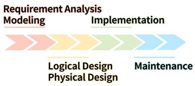
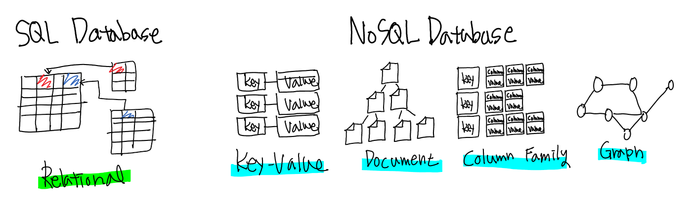
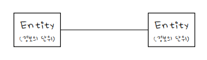

# DB

👩‍💻 작성자 : 정수희 @Suhee Jung 
⏳ 발표시간 : 10분
---

> 본 게시물은 [데이터베이스 개론](https://www.hanbit.co.kr/store/books/look.php?p_code=B8582604063), KOCW 데이터베이스(지정희 교수님), 작성자의 아련한 학부시절 추억, 작성자가 정처기 준비를하며 만든 정리본 및 추가적인 참고자료(하단의 ref에 기입)을 토대로 재구축하여 작성 되었습니다.

## DB란 무엇인가?

### Data

- 실세계에서 관찰/관측/분석을 등을 통하여 얻어지는 모든 지식/정보/자료
- Data가 존재할 때, 이를 적절히 활용하려면 어떻게 해야할까? 👉 컴퓨터에 넣어야지!
- 실세계의 지식을 컴퓨터가 이해할 수 있게끔 정돈하여 컴퓨터에 넣어두는 곳 👉 데이터베이스

### Database, DB
<figure>
      
      <figcaption>army base(tropico 5), 출처 : <a href="https://tropico.fandom.com/wiki/Army_Base_(Tropico_5)">https://tropico.fandom.com/wiki/Army_Base_(Tropico_5)</figcaption>
</figure>

- **Database**는 data + base로 **데이터들의 기지**라는 뜻으로 1950년대에 미국에서 사용되기 시작한 용어
- 여러 사람 혹은 프로그램이 공유하여 사용할 목적으로 통합되어 관리되는 **데이터들의 집합**

### Data는 어떻게 컴퓨터에 저장되는가?

위에서 실세계의 data를 정돈하여 컴퓨터에 저장을 해두는 곳이 DB라고 하였다.
현실 세계의 data는 어떤 과정을 거쳐서 컴퓨터에 저장되고 활용될까?
전체적인 흐름을 살펴보면 아래와 같다. 해당 부분 교재 혹은 글마다 조금 씩의 차이를 보이기 때문제 전체적인 흐름만 가져가는 편이 좋다.

## DB의 종류에는 어떤 것이 있는가?

### DBMS

- Database Management System
- 조직에서 만든 데이터베이스를 통합 저장/관리하기 위한 소프트웨어
- DBMS의 기능
    - 정의 기능 : 데이터베이스 구조를 정의/수정/삭제
    - 조작 기능 : 데이터를 삽입/삭제/수정 등에 관한 연산 작업
    - 제어 기능 : 데이터의 정확성과 안전성을 유지하는 기능, 무결성유지/보안/병행 제어/ ...

### DB의 종류

현대의 Database는 DBMS에서 데이터를 저장하는 방식에 따라 크게 **관계형 데이터베이스**와 **NoSQL**로 나눌 수 있습니다.

- 관계형 데이터베이스(RDB)
    - 전통적으로 많이 사용되는 데이터베이스의 형태
    - 행과 열을 가지는 테이블 형식으로 데이터를 저장하며 SQL을 통하여 조작할 수 있다.
    - RDB의 한계
        - 수평적 확장이 어렵다.
        - 비정형 데이터의 보관에 취약하다.
    - MySQL, PostgreSQL, MariaDB, ...
- NoSQL
    - 비관계형 데이터베이스 모델
    - Key-value Database
        - 데이터가 Key와 Value의 쌍으로 저장되는 형태
        - Value에는 이미지나 비디오 같은 비정형 데이터도 저장이 가능하다.
        - Redis, Amazon Dynamo DB, ...
    - **Document Database**
        - 데이터가 Key와 Document의 한쌍으로 저장되며, 이 때, Document는 계층적인 형태를 가지고 있다. 즉, Document는 key-value collection들을 계층적으로 다시 모아놓은 형태라고 볼 수 있다. 이때, Document는 주로 XML, JSON과 형태를 가지게 된다.
        - MongoDB, CouthDB
    - Wide Column Database
        - Row를 결정하는 Row key에 다수의 column과 value가 결합되는 구조. 이때, Column은 Column Family별로 구성된다.
        - Cassandra, Apache HBase
    - Graph Database
        - 데이터를 node, edge로 구성된 그래프 구조로 표현한 데이터베이스 방식이다. 소셜 네트워크에 적합하고, 추천 시스템, 패턴 인식등에 사용된다.
        - **Neo4J**

## 간단히 살펴보는 데이터베이스의 역사

- 이전에는 file system 형식으로 데이터를 관리하였었다.
    - 프로그램 별로 file를 생성하여 데이터를 관리
    - 중복 데이터 발생 → 데이터의 무결성을 보장할 수 없었음
    - 프로그램이 file 구조에 종속적
- 70' Codd - "**A relational model** of data for large shared data banks"
    - Relational Data Model
    - 대수적인 방법으로 데이터를 표현하는 방법을 제안
    - table 단위의 정보를 element로 하여, algebraic한 기반을 만든다.
- 76' Peter Chan - "The **Entity-Relationship Model** - Toward a Unified View of Data"

    

    - Entiry Relationship Model, 정보의 단위(Entity)와 관계(Relationship)을 통하여 데이터를 표현
    - **ER Mode**l 제안
- 90' Rumbaugh/Booch - OMT
    - Object-Modeling Technique, OOPL(Programming Language) → OOM(Methodology) → OMT(Object Modeling Technique)
- 99' **UML Class Diagram**

 

> 👉 다음 챕터 ) Class Diagram과 ER모델을 이용한 Data Modeling

---

## Ref
- 위키백과 - 데이터베이스 : [https://ko.wikipedia.org/wiki/데이터베이스](https://ko.wikipedia.org/wiki/%EB%8D%B0%EC%9D%B4%ED%84%B0%EB%B2%A0%EC%9D%B4%EC%8A%A4)
- The Database Life Cycle : [https://medium.com/informatics/the-database-life-cycle-4151969ca57d](https://medium.com/informatics/the-database-life-cycle-4151969ca57d)
- A Comparison of NoSQL Database Management Systems and Models : [https://www.digitalocean.com/community/tutorials/a-comparison-of-nosql-database-management-systems-and-models#document-oriented-databases](https://www.digitalocean.com/community/tutorials/a-comparison-of-nosql-database-management-systems-and-models#document-oriented-databases)
- What Is a NoSQL Database? : [https://redis.com/nosql/what-is-nosql/](https://redis.com/nosql/what-is-nosql/)
- [Database] RDBMS와 NoSQL의 차이점 : [https://khj93.tistory.com/entry/Database-RDBMS와-NOSQL-차이점](https://khj93.tistory.com/entry/Database-RDBMS%EC%99%80-NOSQL-%EC%B0%A8%EC%9D%B4%EC%A0%90)

 
 
