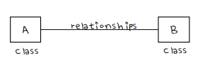
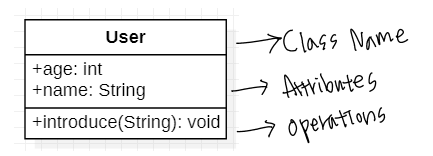
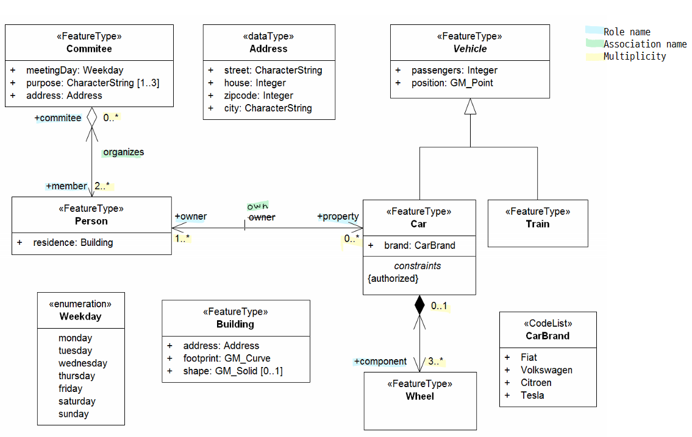
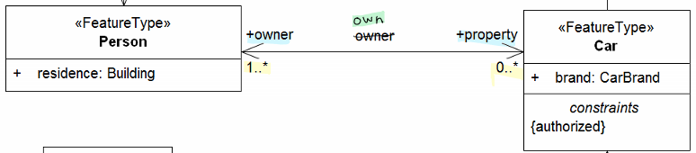
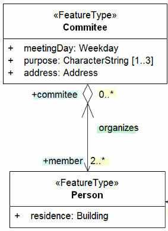
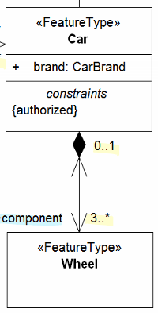
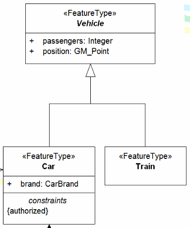
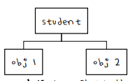
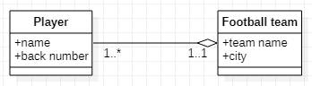

# Data Modeling

👩‍💻 작성자 : 정수희 @Suhee Jung 
⏳ 발표시간 : 20분
---

> 본 게시물은 [데이터베이스 개론](https://www.hanbit.co.kr/store/books/look.php?p_code=B8582604063), KOCW 데이터베이스(지정희 교수님), 작성자의 아련한 학부시절 추억, 작성자가 정처기 준비를하며 만든 정리본 및 추가적인 참고자료(하단의 ref에 기입)을 토대로 재구축하여 작성 되었습니다.

- 실세계에 존재하는 data을 어떻게 conceptual schema로 표현할 것인가?

## UML Class Diagram

- object의 유형을 나타내는 class와 클래스 간의 관계로 이루어진 graphical representation
- Class Diagram의 아래의 필수 구성 요소를 가진다.
    - Class
        - Attributes
        - Operations
    - Relationships : class 사이의 관계
        - Associations
        - Generalization, Aggregation, Composition
    - Constraint Rules and Notes
        - Key Constraints
        - Referential Integrity
        - Weak Entity Sets

### Class

- 공통된 속성 attributes, 연산 operations을 갖는 객체들의 집합
- DB에 저장되는 Entity type

### Relationships

<figure>
      
      <figcaption>원본 출처 : <a href="https://github.com/ISO-TC211/UML-Best-Practices/wiki/Introduction-to-UML">https://github.com/ISO-TC211/UML-Best-Practices/wiki/Introduction-to-UML</figcaption>
</figure>

#### 1️⃣ Associations(연관)

- 두 개의 클래스가 독립적이고 동등한 위치에 있는 관계를 표현한다.
- Association의 그릴때는 다음의 항목들을 추가할 수 있다.
    - role name : 하나의 association이 존재할때, 각각의 class가 가지는 역할
    - association name
    - cardinality/multiplicity : 대응되는 쪽이 몇개냐를 표기. min .. max

        | cardinality |  |
        |:-----------:|:-----|
        | 0 | No instances (rare) |
        | 0..1 | No instances, or one instance |
        | 1 | Exactly one instance |
        | 1..1 | Exactly one instance |
        | 0..* | Zero or more instances |
        | * | 	Zero or more instances |
        | 1..* | One or more instances |

    - 화살표 : 참조 방향을 결정한다. 만약 화살표가 없다면 양단의 클래스는 서로를 참조하는 bi-directional 관계이다.
    - reflexive association : 자기 자신에게 association을 가지는 경우를 표현
        

- 위의 diagram에서 Association을 해석해보면
    - `Person`과 `Car`는 `own` 관계를 가진다 👉 자동차와 사람 사이에는 소유관계가 성립한다.
    - `Person`과 `Car`와의 `own`관계에서 `Person`은 `Car`의  `owner`이다. 👉 사람은 자동차의 소유주이다.
    - `Car`와 `Person`과의 `own`관계에서 `Car`는 `Person`의  `property`이다. 👉 자동차는 사람의 자산이다.
    - `Person`과 `own` 관계에 있는 `Car`가 0 이상이다. 👉 사람은 자동차를 소유하고 있을수도 있고 아닐수도 있다.
    - `Car`와 `own` 관계에 있는 `Person`이 1 이상이다. 👉 자동차는 항상 한명 이상의 소유주가 존재한다.

#### 2️⃣ Aggregation

- association의 특수한 형태로 전체와 구성요소 관계(<b>is part of</b>)를 표현한다.
- 비어있는 마름모 모양의 화살표로 표현되며, 마름모가 향하는 곳이 전체이다
- 옆의 diagram을 해석해보면 <b>Person</b>은 <b>Commitee</b>의 구성요소이다.-라고 할 수 있다.

#### 3️⃣ Composition

- strong aggregation, life time이 같이 연결되어 있는 경우
- 전체가 종료되면, 구성요소 역시 종료 된다.
- 색칠된 마름모 모양의 화살표로 표현되면, 마름모가 향하는 곳이 전체이다.
- 옆의 diagram을 해석해보면
    - `Wheel`은 `Car`의 구성요소이다.
    - `Wheel`은 `Car`가 존재할 때만, 함께 존재한다.

#### 4️⃣ Generalization

- 상위 클래스와 하위 클래스로 나뉘어지며 하위 클래스는 상위 클래스의 속성과 연산을 가지면서 추가적인 속성과 연산을 가지는 보다 구체적인 클래스가 된다.
- ***is kind of***
- 비어있는 삼격형 모양의 화살표로 표현되면, 삼각형이 향하는 곳이 상위 클래스이다.
- 옆의 diagram을 해석해보면
    - `Car`와 `Train`은 `Vehicle`의 한 종류이다.

### Constraint Rules

- Class Diagram의 많은 사항들을 포함하고 있기는 하지만 모든 사항들을 표현하지는 못한다.
- Class Diagram의 표현력을 높이기 위하여 두가지 제약사항을 살펴보자!

#### 1️⃣ Key Constraints

- `obj1`과 `obj2`를 구별할 수 있는 attribute가 적어도 하나 있어야 하며 이를 key라고 한다.
- 모든 Class는 적어도 하나 이상의 key를 가지며, attribute 간의 조합된 것들도 key로 볼 수 있다.
    - ex. 사람을 특정할 수 있는 속성 : (주민등록번호), (거주지, 생년월일), ...
- Primary Key : key 중에 선택 된 main key
- Weak Entity Sets
    - 클래스 내의 attributes 만으로는 key가 존재하지 않아 자기 ***상위***에 있는 class에 있는 key도 합해야지만 key가 되는 경우

    

    - 위와 같은 상황에서 name과 back number 정보만으로는 어떠한 Player를 특정할 수 없다.
    - 만약, Player의 소속 구단 이름과 등번호가 있다면 Player를 특정할 수 있을 것이다.  
    👉 Player의 key는 **(back number, team name)**이 되며,
         team name은 외래키(**foreign key**)라고 한다.

#### 2️⃣ Referential Integrity

- 참조 무결성
- 두 클래스간에 관계가 성립할 때(= 어떤 레퍼런스가 존재할 때). 레퍼런스를 하는 대상이 되는 instance는 반드시 존재해야 한다.

    

- 예를 들어, 위의 상황에서 Car와 연결되어 있는 Person은 반드시 존재해야 한다.

## Relational Data Model : E-R Model

(생략)