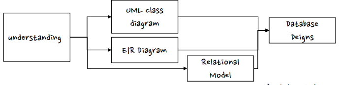
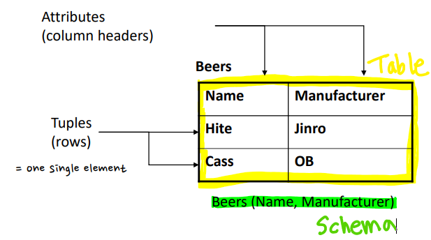
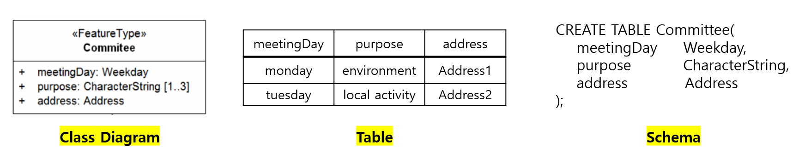
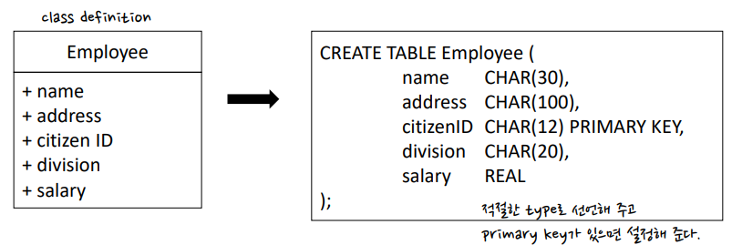

# Data Modeling

👩‍💻 작성자 : 정수희 @Suhee Jung 
⏳ 발표시간 : 20분
---

> 본 게시물은 [데이터베이스 개론](https://www.hanbit.co.kr/store/books/look.php?p_code=B8582604063), KOCW 데이터베이스(지정희 교수님), 작성자의 아련한 학부시절 추억, 작성자가 정처기 준비를하며 만든 정리본 및 추가적인 참고자료(하단의 ref에 기입)을 토대로 재구축하여 작성 되었습니다.

- 실세계의 정보를 어떻게 데이터베이스에 저장할 것인가?

## Relational Model

- 몇 개의 ***table***과 그것들을 관계를 통해서 현실의 데이터를 나타내고자 한다.

### 1️⃣ Table과 Schema

- Table : Relation R between $A_1, A_2, ... , A_n$(Attribute)
- Schema : Structure of table
    - {relation name}(attriubtes)

## 2️⃣ Relational Model and SQL

- Relation은 SQL문을 통하여서 선언 및 조작이 가능하다.
- 데이터를 DB에 어떻게 *How* 저장하는가 → Physical → DBMS
어떤 데이터 *What*를 저장하는가 → Conceptual → Relational data model(← SQL)
👉 SQL을 사용함으로써 Physical 부분과 Conceptual 부분을 완전히 분리해 낼 수 있다.
- Schema Definition in SQL 👉 자세한 사항은 SQL 시간에!

### DB 디자인시 주의사항

> "schema를 어떻게 알아낼 수 있을까?"

#### 1️⃣ Functional Dependency 👉 key 도출

- Relation R의 attribute 부분집합 $A_1, A_2, ..., A_n$이 다른 부분집합 $B$에 사상될 때(=B를 정의할 수 있을 때) $B$는 $A_1, A_2, ..., A_n$에 ***functional dependency***를 가진다고 할 수 있다.
- ex) **Movies** (title, year, length, filmType, studioName, starName)
    - (title year) → length
    - (title year) → filmType
    - (title year) → studioName
    - (title year) → length filmType studioName
    - ? (title year) → starName : more than one star in a film

#### 2️⃣ Key를 어떻게 정의할 것인가?

- Key의 종류

    
    - 슈퍼키(Super Key) : Relation 내에 있는 속성들이 집합으로 구성된 키, key + attributes
    - 후보키(Candidate Key) : super key - key가 아닌 attribute
        - **(citizen ID)**, (name, address)
    - 기본키(Primary Key) : 후보키 중에서 선정된 키, 주로 가장 많이 쓰이는 것
    - 대체키(Alternate Key) : candidate key - primary key
    - 외래키(Foregin Key) : 다른 Relation의 기본키를 참조하는 속성 또는 속성들의 집합
- key를 어떻게 만들어 낼까?!
    - **functional dependency**를 가지고 쭈욱 따져보면서 그 중에서 minimal 한 attribute 가지고 나머지 attribute를 결정하는 조합을 찾아낼 수가 있다.
    - 주어진 context 내에서 key를 찾아 본다. 실세계에 주어진 문제를 잘 이해해본다.

#### 3️⃣ DB를 적절히 나눌 수 있는가?

- DB를 왜 적절히 나누어야할까?

    아래의 테이블에서 발생할 수 있는 문제점?

    

    - Redundancy
    - Update Anomaly
    - Deletion Anomaly
    - 해결안 → Decomposition of Bad Relation

    

- 사용되는 방식 : 데이터베이스 정규화
