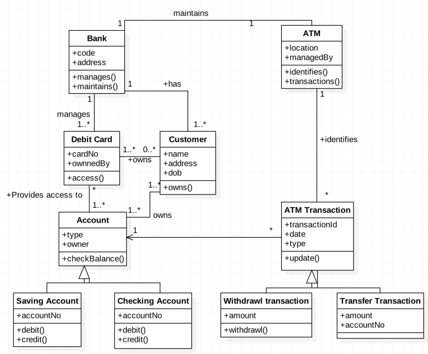
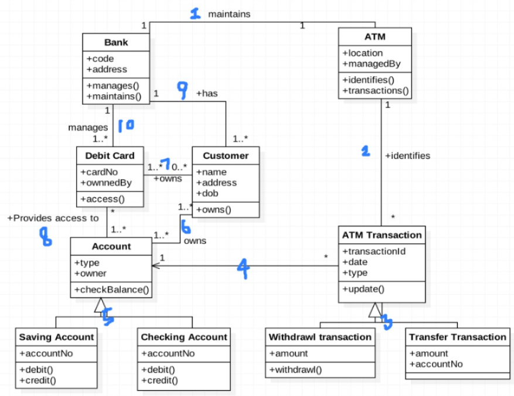
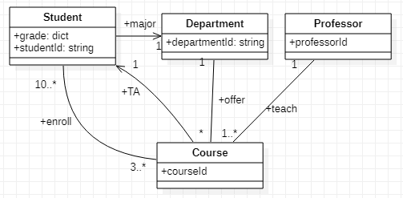
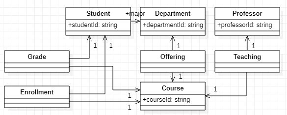
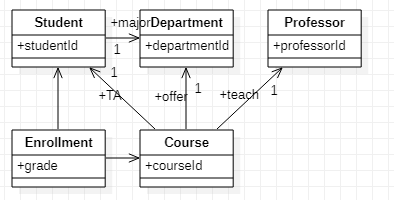

# 실습 1 : Class Diagram

👩‍💻 작성자 : 정수희 @Suhee Jung<br>

---

### (실습 1-1) 주어진 Class Diagram을 해석하여 보자


> 👀 위의 Class Diagram에서 표현되고 있는 Relationship 중 5가지를 선택하여 설명하여 주세요.

<details><summary>🧐</summary>
<p>

 

1. ATM과 Bank는 `maintains` 관계가 있고, 서로에게 유일합니다.
    - Bank는 ATM을 유지하며, 하나의 은행은 하나의 ATM을 보유하고 있습니다.
    - 현실세계에는 있을 수 없는 일이네요🤔

2. ATM과 ATM Transaction은 `identifies` 관계를 가집니다. 이때, ATM Transaction은 하나의 ATM과 `identifies` 관계를 가지며, ATM은 다수(0~many)의 ATM Transaction과 `identifies` 관계를 가집니다.
    - ATM과 ATM Transaction(ATM에서 발생한 거래)는 서로를 식별할 수 있습니다.
    - ATM에서는 다수의 거래가 발생할 수 있고, 거래에는 오직 하나의 ATM이 관여합니다.

 3. Withdrawl transaction과 Transfer Transaction은 ATM Transaction의 한 종류입니다.
    - 거래의 종류에는 출금과 송금이 있습니다.

4. ATM Transaction은 하나의 Account를 참조합니다.
    - ATM에서 한번의 거래는 하나의 계좌에 대해서만 발생합니다.

5. Saving Account와 Checking Account은 Account의 한 종류입니다.
    - 계좌의 종류에는 Saving Account와 Checking Account가 있습니다.
    - [https://blog.naver.com/jaypomfret1/220391596590](https://blog.naver.com/jaypomfret1/220391596590)

6. Account와 Customer는 `owns` 관계를 맺고 있으며 서로를 다수 참조할 수 있습니다.
    - 한 명의 고객은 하나 이상의 계좌를 가질 수 있습니다.
    - 계좌를 개설해야만 고객이라 할 수 있습니다.
    - 하나의 계좌를 여러명의 고객에 의해 소유될 수 있습니다. 공동명의 계좌를 의미하는 듯 합니다🤔

7. Debit Card와 Customer는 `owns` 관계를 맺고 있습니다. Debit Card는 `owns` 관계를 가지는 Customer가 없을 수도 있고 다수일 수도 있습니다. Customer는 `owns` 관계에 있는 Debit Card가 하나 이상입니다.
    - 한명의 고객은 하나 이상의 직불카드를 가집니다.
    - 직불카드는 소유자가 있을 수도 있고 다수일 수도 있습니다. 주인없는 카드가 있을 수 있다는 의미인데, 설계가 잘못된 것이지 않을까 합니다🤔

8. Debit Card와 Account는 `provides access to` 관계에 있습니다. Debit Card는 `provides access to` 관계를 가지는 Account를 하나 이상가지고, Account는 `provides access to` 관계를 가지는 Debit Card가 없을 수도 있고 다수일 수도 있습니다.
    - 직불카드를 이용하면 계좌에 접근할 수 있습니다.
    - 계좌는 연결된 직불카드가 없을 수도 있고 다수일 수도 있습니다.
    - 직불카드는 연결된 계좌가 하나 이상입니다. 이것도 좀 이상하네요🤔

9. Bank와 Customer는 `has` 관계에 있습니다. Bank는 하나 이상의 Customer과 `has` 관계를 가지고, Customer는 하나의 Bank와 `has` 관계를 가집니다.
    - Bank는 한명 이상의 고객을 유치하고 있습니다.
    - 고객은 하나의 은행만을 이용합니다. 고객 충성도가 매우 높은 세계관 입니다🤔

10. Bank와 Debit Card는 `manages` 관계에 있습니다. Bank는 하나 이상의 Debit Card와 `manages` 관계에 있고, Debit Card는 하나의 Bank와 `manages` 관계에 있습니다.
    - 은행은 직불카드를 관리하며, 다수의 카드를 동시에 관리하고 있습니다.
    - 직불카드는 하나의 은행에 의해 관리되고 있습니다.
    </p>
    </details>


### (실습 1-2) 주어진 상황을 보고 Class Diagram을 작성하여 보자.
> Design a database suitable for a university registrar. This database should include information about students, departments, professors, courses, which students are enrolled in which courses, which professors are teaching which courses, student grades, the TA for a course (TA’s are students), which courses a department offers, and any other information you deem appropriate. Note that this question is more free-form than the questions above, and you need to *make some decisions about multiplicities of relationships, appropriate types, and even what information needs to be represented.*

문제 출처 : A First Course in Database Systems

> 👀 위의 지문을 바탕으로 적절한 Class Digram의 작성하여 주세요. 작성 방식은 종이에 그려서 사진을 찍어 올려주셔도 되고 tool을 사용하여 컴퓨터로 작성하여 주셔도 됩니다. 컴퓨터 환경에서 작성을 원하시는 경우, draw.io, gitmind, starUML 중 하나를 사용하는 것을 권장합니다.

<details><summary>🧐</summary>
<p>

1. 지문 분석
   1. 클래스
      - student
        - student grades
      - department
      - professor
      - course
   2. 관계
      - students are enrolled in which courses
        - student class와 course class 사이에는 enrolled 관계가 존재
        - multiplicity : 학생들을 코스들에 참여 → *, *
      - which professors are teaching which courses
        - professor class와 course class 사이에는 teaching 관계가 존재
        - multiplicity : 교수는 코스들을 가르침 → *, 1
      - TA for a course (TA’s are students)
        - student class와 course class 사이에 TA 관계가 존재
        - multiplicity : 하나의 강의에서는 하나의 TA가 존재 → 1, *
      - which courses a department offers
        - course class와 department class 사이에는 offer 관계가 존재
        - multiplicity : 하나의 학과에서 여러개의 강의를 제공하지만, 하나의 강의는 하나의 학과에 종속된다 → 1, *
2. 추가사항
    - class별 PK 추가
    - multiplicity에 현실성을 더하기
    - course가 폐강되지 않으려면 적어도 10명의 학생이 필요하다.
    - 학생은 입학 후 최초의 학기에 적어도 3과목을 수강해야 한다.
    - 교수는 적어도 하나의 과목을 가르친 경험이 있다.
    - 학생과 학부 사이에 `major` 관계 추가
3. 다이어그램 작성
    
    </p>
    </details>


### (실습 1-3) 주어진 Class Diagram을 python의 Class로 작성하여 보자.
> 👀 (실습 1-2)에서 작성한 Class Diagram을 python의 Class로 작성하여 봅시다.

> 🔍 참고자료<br>
UML → JAVA : https://www.nextree.co.kr/p6753/

<details><summary>🧐</summary>
<p>

```python
# probelm_1_2_1.py
student_id_holder = 0

def create_id():
    global student_id_holder
    student_id_holder += 1
    new_id = "STD" + '0' * (4-len(str(student_id_holder))) + str(student_id_holder)
    return new_id

class Student:
    def __init__(self, id, departmentId):
        self.studentId = id
        self.grade = {} # courseId : grade
        self.major = departmentId
        self.enrolled = [] # id of course

    def enroll(self, courseId):
        self.enrolled.append(courseId)

class Department:
    def __init__(self, id):
        self.departmentId = id
        self.offering = [] # course id

    def offer(self, courseId):
        self.offering.append(courseId)

class Professor:
    def __init__(self, id):
        self.professorId = id
        self.teaching = [] # course id

    def teach(self, courseId):
        self.teaching.append(courseId)

class Course:
    def __init__(self, id, professorId, departmentId, TA):
        self.courseId = id
        self.professor = professorId
        self.department = departmentId
        self.TA = TA # student ID
        self.students = [] # student ID

    def enroll(self, studentId):
        self.students.append(studentId)

    def __str__(self):
        return (f"========== Course Info ==========\n"
                f"Course : {self.courseId},\n"
                f"Professor : {self.professor},\n"
                f"Department : {self.department},\n"
                f"TA : {self.TA},\n"
                f"Students : {self.students}")
```

```python
# problem_1_2_2.py
import problem_1_2_1 as P

dept = P.Department('D1')
students = [P.Student(P.create_id(), dept.departmentId) for i in range(10)]
prof_1 = P.Professor('P1')

database_2021_fall = P.Course('DB-2021-F',
                              prof_1.professorId,
                              dept.departmentId,
                              students[9].studentId)

for i, student in enumerate(students[:5]):
    database_2021_fall.enroll(student.studentId)
    student.enroll(database_2021_fall.courseId)

print(database_2021_fall)
# ========== Course Info ==========
# Course : DB-2021-F,
# Professor : P1,
# Department : D1,
# TA : STD0010,
# Students : ['STD0001', 'STD0002', 'STD0003', 'STD0004', 'STD0005']
```
</p>
</details>

### (실습 1-4) 주어진 Class Diagram을 Relation Model로 작성하여 보자.
> 👀 (실습 1-2)에서 작성한 Class Diagram을 SQL의 Create Table 구문을 통해서 Relation Model로 나타내어 보자.

<details><summary>🧐</summary>
<p>

#### 초안


- 테이블 생성
    ```sql
    CREATE TABLE Department(
    departmentId TEXT
    );
    
    CREATE TABLE Student(
    studentId TEXT,
    major TEXT REFERENCES Department(departmentId)
    );
    
    CREATE TABLE Professor(
    professorId TEXT
    );
    
    CREATE TABLE Course(
    courseId TEXT
    );


    ALTER TABLE Student ADD enrolled TEXT REFERENCES Course(courseId);
    ALTER TABLE Student ADD grade TEXT;
    ALTER TABLE Department ADD offering TEXT REFERENCES Course(courseId);
    ALTER TABLE Professor ADD teaching TEXT REFERENCES Course(courseId);
    ALTER TABLE Course ADD professor TEXT REFERENCES Professor(professorId);
    ALTER TABLE Course ADD department TEXT REFERENCES Department(studentId);
    ALTER TABLE Course ADD TA TEXT REFERENCES Student(studentId);
    ALTER TABLE Course ADD students TEXT REFERENCES Student(studentId);
    ```
- 데이터 삽입
    ```sql
    INSERT INTO Student VALUES ('S001', 'CS', 'DB-2021-Fall', 'A');
    INSERT INTO Student VALUES ('S002', 'CS', 'DB-2021-Fall', 'A+');
    INSERT INTO Student VALUES ('S003', 'CS', 'DB-2021-Fall', 'B');
    INSERT INTO Student VALUES ('S004', 'CS', 'DB-2021-Fall', 'C');
    INSERT INTO Student VALUES ('S005', 'CS', 'DB-2021-Fall', 'B+');
    INSERT INTO Student VALUES ('S006', 'CS', 'DB-2021-Fall', 'F');
    INSERT INTO Student VALUES ('S001', 'CS', 'AI-2021-Fall', 'D');
    INSERT INTO Student VALUES ('S002', 'CS', 'AI-2021-Fall', 'A+');
    INSERT INTO Student VALUES ('S007', 'Math', 'AI-2021-Fall', 'B+');
    INSERT INTO Student VALUES ('S008', 'Math', 'AI-2021-Fall', 'A+');
    
    INSERT INTO Department VALUES ('CS', 'DB-2021-Fall');
    INSERT INTO Department VALUES ('CS', 'AI-2021-Fall');
    
    INSERT INTO Professor VALUES ('PROF001', 'DB-2021-Fall');
    INSERT INTO Professor VALUES ('PROF002', 'AI-2021-Fall');
    
    INSERT INTO Course VALUES ('DB-2021-Fall', 'PROF001', 'CS', 'S001', 'S001');
    INSERT INTO Course VALUES ('DB-2021-Fall', 'PROF001', 'CS', 'S001', 'S002');
    INSERT INTO Course VALUES ('DB-2021-Fall', 'PROF001', 'CS', 'S001', 'S003');
    INSERT INTO Course VALUES ('DB-2021-Fall', 'PROF001', 'CS', 'S001', 'S004');
    INSERT INTO Course VALUES ('DB-2021-Fall', 'PROF001', 'CS', 'S001', 'S005');
    INSERT INTO Course VALUES ('DB-2021-Fall', 'PROF001', 'CS', 'S001', 'S006');
    INSERT INTO Course VALUES ('AI-2021-Fall', 'PROF002', 'CS', 'S001', 'S001');
    INSERT INTO Course VALUES ('AI-2021-Fall', 'PROF002', 'CS', 'S001', 'S002');
    INSERT INTO Course VALUES ('AI-2021-Fall', 'PROF002', 'CS', 'S001', 'S007');
    INSERT INTO Course VALUES ('AI-2021-Fall', 'PROF002', 'CS', 'S001', 'S008');
    ```

- **문제점**
    - 테이블내의 데이터 중복이 많다.
        - Student 테이블에서 (studentId, major)가 (enrolled, grade)이 증가함에 따라 반복되고 있다.
        - Course 테이블에서 (courseId, professor, department, TA)가 (student)가 증가함에 따라 반복되고 있다.
        - 이런 문제는 데이터 타입이 collection type인 경우, 이를 표현하기 위해서는 collection type의 한 원소마다 하나의 row을 생성해야하는 것에서 기인한다.

#### 개선1 - 중복을 일으키는 collection type을 모두 분리한다


- 테이블 생성
    ```sql
    CREATE TABLE Department(
    departmentId TEXT PRIMARY KEY
    );
    
    CREATE TABLE Student(
    studentId TEXT PRIMARY KEY,
    major TEXT REFERENCES Department(departmentId)
    );
    
    CREATE TABLE Professor(
    professorId TEXT PRIMARY KEY
    );
    
    CREATE TABLE Course(
    courseId TEXT PRIMARY KEY
    );
    
    CREATE TABLE Grade(
    studentId TEXT,
    courseId TEXT,
    grade TEXT,
    FOREIGN KEY(studentId) REFERENCES Student(studentId),
    FOREIGN KEY(courseId) REFERENCES Course(courseId),
    PRIMARY KEY(studentId, courseId)
    );
    
    CREATE TABLE Enrollment(
    studentId TEXT,
    courseId TEXT,
    FOREIGN KEY(studentId) REFERENCES Student(studentId),
    FOREIGN KEY(courseId) REFERENCES Course(courseId),
    PRIMARY KEY(studentId, courseId)
    );
    
    CREATE TABLE Offering(
    departmentId TEXT,
    courseId TEXT,
    FOREIGN KEY(departmentId) REFERENCES Department(departmentId),
    FOREIGN KEY(courseId) REFERENCES Course(courseId),
    PRIMARY KEY(departmentId, courseId)
    );
    
    CREATE TABLE Teaching(
    professorId TEXT,
    courseId TEXT,
    FOREIGN KEY(professorId) REFERENCES Professor(professorId),
    FOREIGN KEY(courseId) REFERENCES Course(courseId),
    PRIMARY KEY(professorId, courseId)
    );
    ```
- 데이터 삽입
    ```sql
    INSERT INTO Department VALUES ('CS');
    INSERT INTO Department VALUES ('Math');
    
    INSERT INTO Student VALUES ('S001', 'CS');
    INSERT INTO Student VALUES ('S002', 'CS');
    INSERT INTO Student VALUES ('S003', 'CS');
    INSERT INTO Student VALUES ('S004', 'CS');
    INSERT INTO Student VALUES ('S005', 'CS');
    INSERT INTO Student VALUES ('S006', 'CS');
    INSERT INTO Student VALUES ('S007', 'Math');
    INSERT INTO Student VALUES ('S008', 'Math');
    
    INSERT INTO Professor VALUES ('PROF001');
    INSERT INTO Professor VALUES ('PROF002');
    
    INSERT INTO Course VALUES ('DB-2021-Fall');
    INSERT INTO Course VALUES ('AI-2021-Fall');
    
    INSERT INTO Grade VALUES ('S001', 'DB-2021-Fall', 'A');
    INSERT INTO Grade VALUES ('S002', 'DB-2021-Fall', 'A+');
    INSERT INTO Grade VALUES ('S003', 'DB-2021-Fall', 'B');
    INSERT INTO Grade VALUES ('S004', 'DB-2021-Fall', 'C');
    INSERT INTO Grade VALUES ('S005', 'DB-2021-Fall', 'B+');
    INSERT INTO Grade VALUES ('S006', 'DB-2021-Fall', 'F');
    INSERT INTO Grade VALUES ('S001', 'AI-2021-Fall', 'D');
    INSERT INTO Grade VALUES ('S002', 'AI-2021-Fall', 'A+');
    INSERT INTO Grade VALUES ('S007', 'AI-2021-Fall', 'B+');
    INSERT INTO Grade VALUES ('S008', 'AI-2021-Fall', 'A+');
    
    INSERT INTO Enrollment VALUES ('S001', 'DB-2021-Fall');
    INSERT INTO Enrollment VALUES ('S002', 'DB-2021-Fall');
    INSERT INTO Enrollment VALUES ('S003', 'DB-2021-Fall');
    INSERT INTO Enrollment VALUES ('S004', 'DB-2021-Fall');
    INSERT INTO Enrollment VALUES ('S005', 'DB-2021-Fall');
    INSERT INTO Enrollment VALUES ('S006', 'DB-2021-Fall');
    INSERT INTO Enrollment VALUES ('S001', 'AI-2021-Fall');
    INSERT INTO Enrollment VALUES ('S002', 'AI-2021-Fall');
    INSERT INTO Enrollment VALUES ('S007', 'AI-2021-Fall');
    INSERT INTO Enrollment VALUES ('S008', 'AI-2021-Fall');
    
    INSERT INTO Offering VALUES ('CS', 'DB-2021-Fall');
    INSERT INTO Offering VALUES ('CS', 'AI-2021-Fall');
    
    INSERT INTO Teaching VALUES ('PROF001', 'DB-2021-Fall');
    INSERT INTO Teaching VALUES ('PROF002', 'AI-2021-Fall');
    ```

- **문제점**
    - 테이블간의 데이터 중복이 많다.
    - 테이블의 수가 과도하게 많다.
    - 너무 많은 decomposition이 일어났다.
    - 개선안 : class의 수를 줄이고 relationship을 개선한다.
        - Offering(departmentId, courseId) + Teaching(professorId, courseId) + Course(courseId)는 (departmentId, courseId, professorId, TA)로 표현이 가능하다.
        - Grade(courseId, studentId, grade) + Enrollment(courseId, studentId)는 (courseId, studentId, grade)로 표현 가능하다.

#### 개선2 - relationship을 개선하고 불필요한 중복을 제거한다


- 테이블 생성
    ```sql
    CREATE table Department(
    departmentId TEXT PRIMARY KEY
    );
    
    CREATE TABLE Student(
    studentId TEXT PRIMARY KEY,
    major TEXT REFERENCES Department(departmentId)
    );
    
    CREATE TABLE Professor(
    professorId TEXT PRIMARY KEY
    );
    
    CREATE TABLE Course(
    courseId TEXT PRIMARY KEY,
    TA TEXT REFERENCES Student(studentId),
    department TEXT REFERENCES Department(departmentId),
    professor TEXT REFERENCES Professor(professorId)
    );
    
    CREATE TABLE Enrollment(
    studentId TEXT,
    courseId TEXT,
    grade TEXT,
    FOREIGN KEY(studentId) REFERENCES Student(studentId),
    FOREIGN KEY(courseId) REFERENCES Course(courseId),
    PRIMARY KEY(studentId, courseId)
    );
    ```
- 데이터 삽입
    ```sql
    INSERT INTO Department VALUES ('CS');
    INSERT INTO Department VALUES ('Math');
    
    INSERT INTO Student VALUES ('S001', 'CS');
    INSERT INTO Student VALUES ('S002', 'CS');
    INSERT INTO Student VALUES ('S003', 'CS');
    INSERT INTO Student VALUES ('S004', 'CS');
    INSERT INTO Student VALUES ('S005', 'CS');
    INSERT INTO Student VALUES ('S006', 'CS');
    INSERT INTO Student VALUES ('S007', 'Math');
    INSERT INTO Student VALUES ('S008', 'Math');
    
    INSERT INTO Professor VALUES ('PROF001');
    INSERT INTO Professor VALUES ('PROF002');
    
    INSERT INTO Course VALUES ('DB-2021-Fall', 'S001', 'CS', 'PROF001');
    INSERT INTO Course VALUES ('AI-2021-Fall', 'S001', 'CS', 'PRPR002');
    
    INSERT INTO Enrollment VALUES ('S001', 'DB-2021-Fall', 'A');
    INSERT INTO Enrollment VALUES ('S002', 'DB-2021-Fall', 'A+');
    INSERT INTO Enrollment VALUES ('S003', 'DB-2021-Fall', 'B');
    INSERT INTO Enrollment VALUES ('S004', 'DB-2021-Fall', 'C');
    INSERT INTO Enrollment VALUES ('S005', 'DB-2021-Fall', 'B+');
    INSERT INTO Enrollment VALUES ('S006', 'DB-2021-Fall', 'F');
    INSERT INTO Enrollment VALUES ('S001', 'AI-2021-Fall', 'D');
    INSERT INTO Enrollment VALUES ('S002', 'AI-2021-Fall', 'A+');
    INSERT INTO Enrollment VALUES ('S007', 'AI-2021-Fall', 'B+');
    INSERT INTO Enrollment VALUES ('S008', 'AI-2021-Fall', 'A+');
    ```

</p>
</details>

### Ref
- UML Class Diagram Examples : [https://www.edrawsoft.com/example-uml-class-diagram.html](https://www.edrawsoft.com/example-uml-class-diagram.html)
- A First Course in Database Systems, by J.D. Ullman and Jennifer Widom, 3rd edition, Pearson International Edition

<br>
<br>
<br>