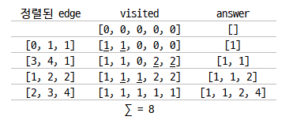

### 문제주소
> https://programmers.co.kr/learn/courses/30/lessons/42861


### 문제접근 방식
도시 연결 + 그리디 👉 MST 문제 👉 Kruskal

1. 입력된 edge를 weight를 기준으로 오름차순 정렬
2. 두개의 배열을 초기화 한다.
  - visited : node의 방문여부 기록, 기록되는 값은 노드가 속하는 그룹, 0으로 초기화
  - answer : 선택된 edge의 weight를 기록, 빈 배열로 초기화
3. edge를 순회하면 아래의 조건에 따라 동작하면 배열의 값을 변경한다.
    - 현재 선택된 edge에 연결된 두 node n1, n2에 대하여
        - 두 노드 다 방문 전(`visited[n1] == 0 && visited[n2] == 0`)이라면, 새로운 그룹을 추가하고 visited의 값을 그룹으로 할당한다. answer에 현재 edge의 weight를 추가한다.
        - 두 노드 중 하나의 노드에 방문을 했었다(`visited[n1] == 0 && visited[n2] > 0`, `visited[n1] > 0 && visited[n2] == 0`)면, 방문 전 노드의 visited 값을 방문한 노드의 그룹 값으로 할당한다. answer에 현재 edge의 weight를 추가한다.
        - 두 노드를 모두 방문했었는데 서로 같은 그룹(`visited[n1] == visited[n2]`)이라면, 아무 동작도 하지 않는다.
        - 두 노드를 모두 방문했었는데 서로 다른 그룹(`visited[n1] != visited[n2] && visited[n1] > 0 && visited[n2] > 0`)이라면, n2의 그룹을 n로 병합한다. answer에 현재 node의 weight를 추가한다.
4. answer의 길이가 n-1에 도달하면 순회를 종료한다.
5. answer의 합을 반환한다.

#### 입출력 예
n=4, costs=[[0,1,1],[0,2,2],[1,2,5],[1,3,1],[2,3,8]], return=4



### Solution
### Python
```python
import numpy as np

def solution(n, costs):
    visited = np.zeros(n, dtype=int) # cycle 체크를 위한 그룹기입
    answer = [] # 선택된 간선의 weight
    g = 0 # 그룹번호

    costs_sorted =  sorted(costs, key=lambda x: x[2])

    for s, e, c in costs_sorted:
        if visited[s] == 0 and visited[e] == 0: # 둘다 방문 X
            # 그룹 추가
            g += 1
            visited[s] = g
            visited[e] = g
        elif visited[s] == visited[e]: # 같은 그룹
            continue
        elif visited[s] > 0 and visited[e] == 0: # 첫번째만 방문
            # 두번쨰가 첫번째 그룹으로 삽입
            visited[e] = visited[s]
        elif visited[s] == 0 and visited[e] > 0: # 두번째만 방문
            visited[s] = visited[e]
        else: # 서로 다른 그룹
            # 두번째가 속한 그룹을 첫번째가 속한 그룹으로 병합
            visited[visited == visited[e]] = visited[s]

        answer.append(c)
        if len(answer) == n-1: break;

    return sum(answer)
```

#### JavaScript
```javascript
// minimum spanning tree
function solution(n, costs) {
  let answer = 0

  let group = []
  let visited = {}
  let cnt = 0

  costs.sort((a,b) => a[2] - b[2])

  let i = 0
  while(costs.length > i && n - 1 > cnt ){
    let isVisited0 = visited[costs[i][0]] ? true : false
    let isVisited1 = visited[costs[i][1]] ? true : false

    if(isVisited0 && isVisited1){
      // s, d visited -> group check
      let groupNum = [-1, -1]
      for(let j = 0 ; j < group.length; j++){
        if(groupNum[0] == -1)
          groupNum[0] = group[j].indexOf(costs[i][0]) > -1 ? j : -1

        if(groupNum[1] == -1)
          groupNum[1] = group[j].indexOf(costs[i][1]) > -1 ? j : -1

        if(groupNum[0] != -1 && groupNum[1] != -1)
          break;
      }

      // 1. same group -> continue
      if(groupNum[0] == groupNum[1]) {
        i++
        continue
      }

      // 2. diff group -> union group, cnt ++, answer += cost
      group[groupNum[0]] = group[groupNum[0]].concat(group[groupNum[1]])
      group.splice(groupNum[1], 1)

    }
    else if(isVisited0){
      // s visited

      // add d to visited
      visited[costs[i][1]] = true

      // add d to group
      group.some(g => {
        if(g.indexOf(costs[i][0]) > -1){
          g.push(costs[i][1])
          return true
        }
        return false
      })
    }
    else if(isVisited1){
      // d visited

      // add s to visited
      visited[costs[i][0]] = true

      // add s to group
      group.some(g => {
        if(g.indexOf(costs[i][1]) > -1){
          g.push(costs[i][0])
          return true
        }
        return false
      })
    }
    else {
      // not visited s, d

      // add s and d to visited
      visited[costs[i][0]] = true
      visited[costs[i][1]] = true

      // add new group
      group.push([costs[i][0], costs[i][1]])
    }

    answer += costs[i][2]
    i++
    cnt ++
  }

  return answer;
}
```


<br>
<br>
