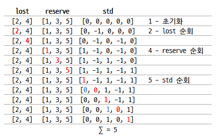

### 문제주소
> https://programmers.co.kr/learn/courses/30/lessons/42862


### 문제접근 방식

1. 초기화 : 학생의 수 n만큼의 길이를 가지는 배열(std)을 생성하고 0으로 초기화한다.
2. lost를 순회하며 체육복을 도난 당한 학생의 std 값에 1을 빼준다.
3. reserve를 순회하며 여벌의 체육복을 가진 학생 학생의 std 값에 1을 더해준다.
4. std를 순회하면 값이 -1인 경우, 전후의 값에 1이 있다면, 해당 값을 -1하고 현재 값에 +1을 해준다.
5. std에서 그 값이 0 이상인 것의 갯수를 구한다.

✨ 학생 수가 최대 30명이라 배열을 순회하는 것에 대한 부담감이 없어 가능한 방식이다. 만약 제약조건이 달라진다면 풀이도 달려져야 할 것이다.

#### 입출력 예
n=5, lost=[2, 4], reserve=[1, 3, 5], return=5



### Solution
#### JavaScript
```javascript
function solution(n, lost, reserve) {
    let answer = 0;

    let std = []
    for(let idx = 0; idx <= n; idx++) std.push(0)

    lost.forEach((val, idx) => { std[val]-- })
    reserve.forEach((val, idx) => { std[val]++ })
    std.forEach((val, idx) => {
        if(val >= 0) return;
        if(idx > 0 && std[idx-1] == 1){ // 이전
            std[idx]++
            std[idx-1]--
        }
        else if(idx < n-1 && std[idx+1] == 1){
            std[idx]++
            std[idx+1]--
        }
    })

    std.splice(0,1)
    answer = std.reduce((acc, cur) => cur >= 0 ? acc + 1 : acc, 0)

    return answer;
}
```

#### Python
```python
def solution(n, lost, reserve):
    answer = 0
    std = [0]*n
    for i in lost: std[i-1] -= 1
    for i in reserve: std[i-1] += 1
    for i, e in enumerate(std):
        if e >=0 : continue
        if i > 0 and std[i-1] == 1 :
            std[i-1] -= 1
            std[i] += 1
        elif i < n-1 and std[i+1] == 1:
            std[i+1] -= 1
            std[i] += 1

    return sum([1 if e >= 0 else 0 for e in std])

if __name__ == "__main__":
    print(solution(5, [2, 4], [1, 3, 5]), 5)
    print(solution(5, [2, 4], [3]), 4)
    print(solution(3, [3], [1]), 2)
```

<br>
<br>
